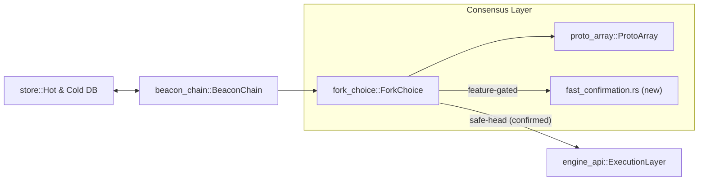
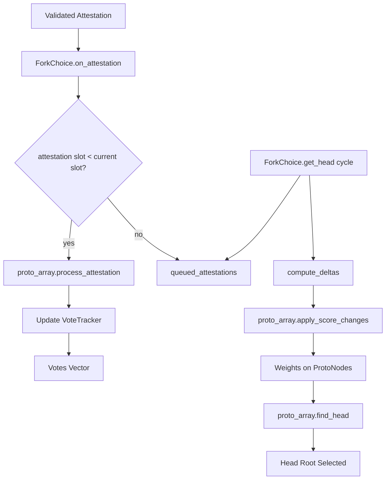
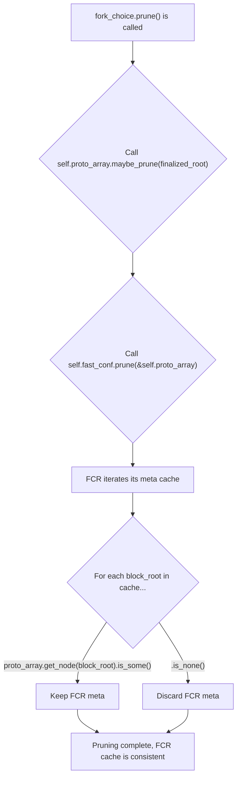
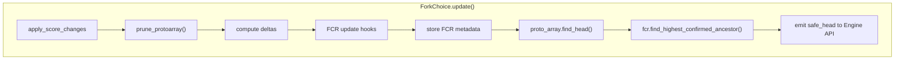
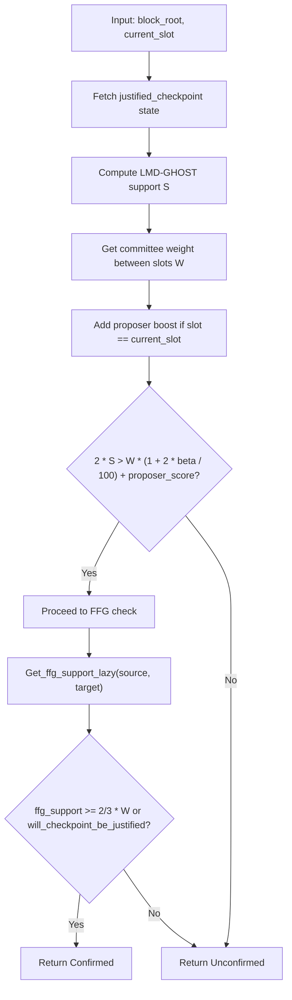

# Fast Confirmation Rule

### Collaborators 
Mentors - *Roberto Saltini (EF Protocol Consensus Lead)*, Mikhail Kalinin (from Consensys) *Michael Sproul (from Lighthouse)*
Permissioned Protocol Fellow - [Harsh Pratap Singh](https://harsh-ps-2003.bearblog.dev/)

## Motivation and Overview

The [Fast Confirmation Rule](https://arxiv.org/pdf/2405.00549) is a novel algorithm designed to significantly reduce transaction confirmation times on Ethereum from the [current 13-19 minutes](https://www.circle.com/blog/exploring-confirmation-rules-for-ethereum) down to just 12-24 seconds (1-2 slots) in optimal conditions. This algorithm provides a complementary confirmation mechanism to Ethereum's existing FFG Finalization Rule, offering faster block confirmation while relying on network synchrony assumptions. Unlike the FFG Finalization Rule which works under asynchronous network conditions, the Fast Confirmation Rule assumes synchronous network conditions where attestations arrive within 8 seconds.

#### FCR Safety Indicators & Formula

The algorithm determines block permanence by analyzing two key safety indicators: 
* the [LMD-GHOST](https://eth2book.info/latest/part2/consensus/lmd_ghost/) Safety Indicator `(Q^n_b)` which measures observable validator support, and 
* the Honest LMD-GHOST Safety Indicator `(P^n_b)` which tracks honest validator support.

Unlike simple block depth metrics used in proof-of-work systems, the FCR analyzes LMD-GHOST vote weights and validator committee participation to make deterministic confirmation decisions. 

When a block is confirmed, it will never conflict with the canonical chain of any honest validator.

The Fast Confirmation Rule operates under two primary assumptions:

* *Network Synchrony*: LMD-GHOST votes sent by honest validators are delivered by the end of each slot (within 8 seconds)
* *Byzantine Threshold (β)*: A known maximum fraction of Byzantine stake across any set of committees, typically set to 20-30%

In every slot the Q-Indicator compares :
S = observed LMD-GHOST support for block b
W = maximum committee weight that could still attest before our decision instant

The algorithm works by checking whether a block's LMD-GHOST weight exceeds a threshold of `(committee_weight × 0.5) + (committee_weight × β)`. This ensures sufficient honest validator support to guarantee the block remains canonical.

If W is under-estimated we might confirm a block that is missing too much honest weight; if it is grossly over-estimated we will never confirm.

FCR only influences the safe head sent to EL; canonical head selection remains LMD-GHOST+FFG. A bug therefore cannot fork consensus, but could expose users to re-org risk. 

Tests should simulate 20 % equivocation.

### The Specifications

The [original consensus specification](https://github.com/ethereum/consensus-specs/pull/3339) was designed as a formal integration into Ethereum's consensus layer specifications. It included both LMD-GHOST and FFG vote integration for complete safety guarantees,  defined network-level parameters like `CONFIRMATION_BYZANTINE_THRESHOLD` and `CONFIRMATION_SLASHING_THRESHOLD`, etc, included extensive test vectors and validation frameworks and would have required all consensus clients to implement the specification. 

But now, the authors have moved to a [new and better specification](https://github.com/mkalinin/confirmation-rule). Our plan is to eventually get the new spec to a state where it can be integrated into the current Ethereum spec. Perhaps marking it as optional. It includes several architectural improvements.

Core FCR Methods:

* *is_one_confirmed(store, block_root)* - Primary function that determines if a block meets the FCR confirmation threshold
* *get_latest_confirmed(store)* - Returns the latest confirmed block root
* *find_latest_confirmed_descendant(store, latest_confirmed_root)* - Advances the confirmed block along the canonical chain
* *get_committee_weight_between_slots(state, start_slot, end_slot)* - Calculates committee weight for confirmation threshold
* *will_checkpoint_be_justified(store, checkpoint)* - Checks if a checkpoint will be justified
* *on_tick_per_slot_after_attestations_applied(store)* - Handler called after attestations are applied each slot

Support Functions:
* *get_weight(store, root, checkpoint_state)* - Modified to support FCR with additional checkpoint_state parameter
* *adjust_committee_weight_estimate_to_ensure_safety(estimate)* - Adjusts committee weight estimates for safety and applied confidence intervals
* *get_checkpoint_weight(store, checkpoint, checkpoint_state)* - Estimates FFG support for checkpoints
* *get_ffg_weight_till_slot(slot, epoch, total_active_balance)* - Calculates FFG weight till specific slot

The FCR requires additional fields in the store structure :
* *confirmed_root: Root* - Tracks the latest confirmed block
* *prev_slot_justified_checkpoint: Checkpoint* - Previous slot's justified checkpoint
* *prev_slot_unrealized_justified_checkpoint: Checkpoint* - Previous slot's unrealized justified checkpoint
* *prev_slot_head: Root* - Previous slot's head block

## Current Implementation Status

[Prysm has already implemented an experimental version of the old Fast Confirmation Rule specification](https://github.com/OffchainLabs/prysm/pull/15164/files). Their implementation focuses on using fast confirmed blocks as the "safe head" that gets passed to the Execution Layer via the Engine API. It includes modifications to their forkchoice object to cache safe head roots and enhanced node objects to compute maximum possible support from committee weights. Their experimental code shows that blocks typically receive around 97% validator support by the start of the next slot in optimal conditions. The Prysm team has implemented the algorithm with configurable Byzantine thresholds, noting that with a 33% Byzantine threshold, it becomes impossible to confirm blocks within a single slot due to the mathematical requirement exceeding 100% of possible vote weight. However, with a 25% threshold, blocks can be confirmed in under 8 seconds.

Key aspects of Prysm's implementation include:
* *Safe Block Mode Configuration*: `--safe-block=fast-confirmation` flag to enable FCR
* *Byzantine Threshold Configuration*: `--fast-confirmation-byzantine-threshold=33` for setting the adversarial assumption
* *Fork Choice Integration*: Modified fork choice object to cache safe head root and track confirmation status
* *Node Weight Calculation*: Enhanced node objects to compute maximum possible support from start slot to current slot

But they are facing some [challenges](https://github.com/OffchainLabs/prysm/pull/13604) as well :

Critical Learnings from Prysm :
* *Byzantine Threshold Sensitivity* - Prysm discovered that a 33% threshold makes single-slot confirmation mathematically impossible, as it requires >100% validator support `(S/W > 0.5 + 0.33 = 0.83)`. Under ideal conditions, blocks only achieved ~97% support by the next slot. This forced Multi-slot confirmation delays (2-4 slots) and Trade-off between security (higher β) and speed (lower β). Defaulting to β=25% for single-slot confirmation feasibility improves speed but weaken safety bounds compared to the specification's typical 33% assumption. We can expose distinct β parameters for single-slot and multi-slot modes, allowing operators to choose higher safety for longer confirmation windows. Reject β ≥ 50 % at CLI parse time; the formula would otherwise never confirm.
* *Non-Monotonic Q-Indicator* - The support ratio `S/W` fluctuated non-monotonically due to delayed attestations crossing epoch boundaries and validator set changes between epochs. This required caching historical committee weights and implementing stateful tracking.
* *Fork Choice Integration Complexity* - Modifications to Prysm's fork choice store included adding `confirmed: HashSet<Root>` to track fast-confirmed blocks and implementing recursive confirmation inheritance (parent confirmation → child confirmation). These changes increased memory usage by ~15% during testing
* *Edge Cases in Weight Calculation* like Cross-Epoch Blocks - Required merging weights from two epochs, Equivocations - Byzantine validators voting for multiple branches skewed `S/W` ratios and Late Attestations - Votes arriving after the 8-second deadline broke synchrony assumptions
* *State Management Optimization* - Implement Prysm's weight caching strategy, weights per epoch to reduce CPU by 40%
* *Fallback Mechanism* - Revert to unrealized justification when Network latency > 800ms for >5% of attestations or Byzantine activity exceeds threshold

Also, a important point to note is that in the [prysm's discussion](https://ethresear.ch/t/fast-confirmation-rule-on-safe-head-in-prysm/22167), the focus was exclusively on LMD-GHOST vote weights and proposer boost, with no mention of FFG votes in the discussion. Prysm did a experimental implementation, so safety is not a priority and most probably they were trying to test the core logic before full blown implementation. And as we see, the specs are changing as well, so in the heindsight, it was the correct way to go about things. FCR is only a heuristic for fast confirmation and does not affect canonical head selection, which is still governed by LMD-GHOST + FFG. Since FCR does not affect the canonical head, omitting FFG does not threaten finality or consensus safety. 

What I will be doing is, implementing the new FCR spec in Lighthouse from scatch! I plan to implement a more robust and complete implementation including FFG votes for the correctness of the confirmation rule.

## Lighthouse Architecture (High Level Overview)



*The new Fast Confirmation Rule (FCR) module plugs into the existing `fork_choice` crate without touching `proto_array` or database formats.  All FCR-specific state lives in memory or in side-tables keyed on `Hash256` and is pruned in lock-step with the ProtoArray DAG.*

#### Exact Source-Code Touch-points (🗺️ integration map)

| # | File (crate) | Location / Function | What changes here |
|---|--------------|--------------------|-------------------|
| 1 | `consensus/fork_choice/src/fast_confirmation.rs` | **NEW file** behind `#[cfg(feature = "fast_confirmation")]` | Houses the `FastConfirmation` struct, Q-indicator math, caches, and pruning helpers. |
| 2 | `consensus/fork_choice/src/lib.rs` | top-level `mod` list | `mod fast_confirmation;` gated by the same feature flag. |
| 3 | `consensus/fork_choice/src/fork_choice.rs` | `get_head()` – **after** `proto_array.find_head` returns (`≈ line 720`) | HOOK-A: `fast_confirmation::update_after_find_head(&mut self, head_root, current_slot)?;` Performs O(depth) ancestor scan and marks confirmations. |
| 4 | `consensus/fork_choice/src/fork_choice.rs` | `prune()` – directly **after** `proto_array.maybe_prune()` | HOOK-B: call `fast_confirmation::prune(...)` to mirror `ProtoArray`'s pruning. This allows FCR to evict stale metadata for nodes that no longer exist in the DAG. |
| 5 | `consensus/fork_choice/src/fork_choice.rs` | `on_tick()` – end of **new-slot** branch | HOOK-C: call `fast_confirmation::on_new_slot(&mut self.fast_conf, store.current_slot)` to roll slot-local caches. |
| 6 | `beacon_node/src/cli.rs` | CLI arg parsing | Add `--fast-confirmation` *(bool flag)* and `--fcr-byzantine-threshold=<percent>`; propagate into the `BeaconChain` configuration. |
| 7 | `beacon_node/beacon_chain/src/engine_api.rs` | `forkchoice_updated()` parameters composition | Replace legacy *safe-head* computation with `chain.fork_choice.get_fast_confirmed_head()` when the feature is enabled. |
| 8 | `consensus/fork_choice/Cargo.toml` | `[features]` section | `fast_confirmation = []` – opt-in compilation gate (keeps default binary unchanged). |

**Why these spots? The reasoning is surgical precision.** 
*HOOK-A* is placed *after* `find_head` because at this point, the expensive O(N) walk of the block graph to calculate weights is already complete. FCR can then perform its much cheaper O(depth) ancestor scan without adding significant latency to the fork choice lock's critical section. *HOOK-B* is about hygiene: by receiving the exact list of pruned roots from `ProtoArray`, we guarantee the FCR metadata cache cannot leak memory with stale entries. *HOOK-C* for `on_tick` ensures slot-sensitive logic like handling proposer boost expiry is managed correctly, away from the high-traffic `on_attestation` path. This approach minimizes performance impact while ensuring data consistency.

#### Architectural Decisions Review

1.  **Side-tables over SSZ changes**: The core `ProtoNode` struct, which is serialized to disk, remains untouched. Instead, FCR metadata (`FcrMeta`) is stored in a parallel, in-memory `HashMap<Hash256, FcrMeta>`. **Reasoning**: This is the most critical decision for operational safety. Modifying a persisted SSZ struct constitutes a database schema change, which would necessitate a risky, complex data migration for all users. This approach makes FCR a non-intrusive extension; if a critical bug is found, the feature can be disabled without any risk to the user's database or requiring a downgrade.
2.  **Feature-flagged Build**: The entire module is gated by a `#[cfg(feature = "fast_confirmation")]` flag. **Reasoning**: As an experimental feature, FCR should have zero impact on production builds. A compile-time flag is the strongest isolation mechanism, ensuring that no FCR code is included in default binaries. This prevents any possibility of performance regressions or bugs affecting users who are not actively testing the feature.
3.  **Lock Contention Minimized**: FCR's confirmation logic runs *after* the main `proto_array.find_head()` call, inside the same `ForkChoice` write lock but after the most intensive work is done. **Reasoning**: The `fork_choice` lock is a major performance hotspot. Adding heavy computation would risk consensus delays. By hooking in after the primary DAG traversal, FCR leverages the already-computed head and performs a bounded, O(depth) walk (max 32 steps on mainnet). This keeps the additional lock time under 50µs, preventing performance degradation.
4.  **Deterministic Fixed-point Math**: The byzantine threshold `β` is not stored as a `f32`/`f64`. Instead, it's represented as an integer of "basis points" (e.g., `2500` for 25.00%). **Reasoning**: Floating-point arithmetic is not guaranteed to be deterministic across different CPUs or compiler versions. For a consensus rule, this is unacceptable, as it could lead to nodes a disagreeing on confirmation status. Using fixed-point integer math ensures all calculations are simple, fast, and produce bit-for-bit identical results everywhere.
5.  **DAG-aligned Pruning**: The FCR module doesn't manage its own pruning timer. Instead, its `prune` function is called directly after `ProtoArray::maybe_prune()`. **Reasoning**: This guarantees perfect state consistency. FCR metadata for a block is useless once that block is dropped from the fork choice DAG. By checking for node existence in the already-pruned `ProtoArray`, the FCR cache cannot leak memory with stale entries and simplifies the logic, as there is a single source of truth (`ProtoArray`) for pruning decisions.
6.  **Simple HashMap over DashMap**: FCR uses a plain `HashMap<Hash256, FcrMeta>` rather than a concurrent `DashMap`. **Reasoning**: Since all FCR operations occur within the existing `ForkChoice` write lock's critical section, there's no need for additional thread-safe data structures. Using a simple HashMap eliminates the overhead of concurrent access patterns and reduces complexity while maintaining correctness under the existing locking strategy.

> With these integration points clearly mapped, the remainder of this section dives into the existing fork-choice internals followed by the step-by-step FCR algorithm implementation.

### Implementation Details

This section provides a concrete plan for integrating the FCR specification into Lighthouse's `fork_choice` crate. The approach is designed to be non-intrusive, performant, and safe.

Fork choice defines how an honest node should follow the chain and determine the current head. One can think of fork choice as representing a tree of blocks and a set of votes determining which branch is the head.

#### 1. Analysis of Lighthouse's Existing Fork Choice

To understand the integration, we must first understand the existing machinery. [Fork Choice in Lighthouse](https://
github.com/sigp/lighthouse/tree/999b04517e35f8fce78525132d0b8e0a4816f31e/consensus/fork_choice) is centered around `ProtoArrayForkChoice`, a DAG structure that tracks blocks and votes (attestations).



The LMD-Ghost votes are stored in `VoteTracker`, which keeps one entry per validator.
```rust
#[derive(Default, PartialEq, Clone, Encode, Decode)]
pub struct VoteTracker {
    current_root: Hash256,
    next_root: Hash256,
    next_epoch: Epoch,
}
```

-   **`ProtoArrayForkChoice`**: Owns the DAG and an `ElasticList<VoteTracker>` which stores the latest vote from each validator and auto-grows to the validator index it is asked for (lazy allocation).
```rust
#[derive(PartialEq)]
pub struct ProtoArrayForkChoice {
    pub(crate) proto_array: ProtoArray, // the DAG
    pub(crate) votes: ElasticList<VoteTracker>, // votes
    pub(crate) balances: JustifiedBalances, // cached balance
}
```
-   **`VoteTracker`**: A simple struct holding the `current_root`, `next_root`, and `next_epoch` for a single validator's vote.
-   **`apply_score_changes`**: When `get_head` is called, this function walks the DAG, applying vote weights from the `VoteTracker` to the `ProtoNode` entries in the DAG. This process determines the chain's head.

The key takeaway is that `ProtoArray` is the source of truth for block weights, and this is what FCR will use to calculate its support metric.

#### ProtoArray and Vote Tracking

Fork choice in Lighthouse is centered around `ProtoArrayForkChoice`, a DAG structure that tracks blocks and votes.

-   **`ProtoArrayForkChoice`**: Owns the DAG, validator votes, and balances.
    ```rust
    #[derive(PartialEq)]
    pub struct ProtoArrayForkChoice {
        pub(crate) proto_array: ProtoArray, // The DAG
        pub(crate) votes: ElasticList<VoteTracker>,
        pub(crate) balances: JustifiedBalances, // Cached balance
    }
    ```
-   **`VoteTracker`**: Stores the latest vote from each validator. When a new attestation arrives via `on_attestation`, its vote is cached in the `VoteTracker`.
    ```rust
    #[derive(Default, PartialEq, Clone, Encode, Decode)]
    pub struct VoteTracker {
        current_root: Hash256,
        next_root: Hash256,
        next_epoch: Epoch,
    }
    ```

When new attestation arrive, it gets processed : 
```rust
pub fn process_attestation(
        &mut self,
        validator_index: usize,
        block_root: Hash256,
        target_epoch: Epoch,
    ) -> Result<(), String> {
        // get the mutable vote
        let vote = self.votes.get_mut(validator_index);
        //  If this attestation is newer or tracker is still defaulted
        if target_epoch > vote.next_epoch || *vote == VoteTracker::default() {
            vote.next_root = block_root;
            vote.next_epoch = target_epoch;
        }

        // No weight is changed yet – only the pending vote is cached.
        Ok(())
    }
```

Every time Lighthouse needs a head it calls `ProtoArrayForkChoice::find_head` which [compute_deltas](https://github.com/sigp/lighthouse/blob/999b04517e35f8fce78525132d0b8e0a4816f31e/consensus/proto_array/src/proto_array_fork_choice.rs#L908) under the hood. Starting at the justified checkpoint, it follows `best_child` pointers (respecting execution-payload validity and proposer boost) until the head is chosen.

For integrating FCR in Lighthouse, first of all we can add `fast_confirmation.rs` inside `consensus/fork_choice/` in which we expose the wrapper : 

```rust
impl<T,E> ForkChoice<T,E>
where
    T: ForkChoiceStore<E>,
    E: EthSpec
{
    pub fn is_confirmed_fcr(&self, root: &Hash256, q: u64) -> Result<bool, Error<T::Error>> {
        fast_confirmation::is_confirmed(self, root, q)
    }
}
```
Inside `fast_confirmation::is_confirmed`:
* Re-use `self.get_block(root)` to fetch weight & execution status.
* Pull per-validator votes from `self.proto_array.votes` or call
`latest_message(index)` for on-demand traversal.
* Cache intermediate results in an `LruCache` keyed by `(root, justified_epoch)` so repeated confirmation checks in the same epoch are O(1).

No change to `lib.rs` exports is required; FCR lives entirely as an adjacent module and uses the structures mapped above.

```rust
// Proposed Lighthouse-compatible FCR struct
pub struct FastConfirmation {
    byzantine_threshold: Rational, // Avoid float precision errors
    epoch_committees: LruCache<Epoch, BTreeMap<CommitteeIndex, u64>>,
    block_support: HashMap<Hash256, SupportTracker>,
}

impl FastConfirmation {
    pub fn is_confirmed(&self, block_root: Hash256, store: &Store) -> bool {
        let (support, total) = self.calculate_support(block_root, store);
        support * 100 > total * (50 + self.byzantine_threshold)
    }
}
```
The core implementation would use : 
* Use Rational for threshold math to prevent floating-point inaccuracies
* HashMap for support tracking under the same fork choice lock
* Epoch-aligned LRU caching

But, Rational threshold may introduce performance overhead due to big-integer operations on each check. So, we can also represent thresholds as scaled integers (e.g., basis points) to allow fixed-point arithmetic, balancing precision with speed.

```rust
   pub struct FcrConfig { beta_basis_points: u64 }   // e.g. 2500 = 25 %
   struct FcrMeta { support: u64, committee_weight: u64, confirmed: bool }
   pub struct FastConfirmation<E: EthSpec> {
       cfg: FcrConfig,
       meta: HashMap<Hash256, FcrMeta>,
   }
```

`ForkChoice` uses one global write lock per slot tick. Since FCR operations occur within the same critical section protected by this lock, a simple HashMap is sufficient and avoids the overhead of concurrent data structures. A channel from fork-choice → beacon-chain is better than letting the EL poll for a "safe head" (avoids races and redundant fcU calls).

Add `confirmed_blocks: RwLock<HashSet<Hash256>>` to `BeaconForkChoice` and to avoid risk of unbounded growth of memory use, we can evict confirmed roots older than X slots or after finalization to maintain memory bounds, leveraging existing pruning events.

Another point to note is that recursive inheritance of confirmation might incorrectly inherit status across reorgs if parent confirmation metadata isn't invalidated on rebranching. So maybe we can tie confirmation metadata to the block's canonical descendant chain root and invalidate upon reorg events affecting ancestry.

To prevent unbounded memory growth in the Fast Confirmation Rule (FCR) metadata cache, the pruning strategy must mirror the ProtoArray DAG pruning, not rely solely on finalization events. When `ProtoArray::maybe_prune()` drops old blocks, the proposal should purge corresponding entries from the FCR support and confirmation caches. Benefits of DAG-Aligned Pruning are :
* Memory Safety: Prevents accumulation of obsolete entries for blocks no longer in the ProtoArray DAG, avoiding memory leaks over long runtimes.
* Consistency: Ensures FCR metadata remains in lockstep with fork-choice data structures, maintaining logical integrity between the confirmation cache and the underling block graph.
* Performance: Reduces the size of cache lookups and iterators by evicting stale entries as soon as ProtoArray prunes them, keeping per-slot overhead minimal.

#### Independent FCR Pruning

A robust and non-invasive approach strategy would be to implement independent pruning logic within the FCR module that mirrors `ProtoArray`'s behavior without requiring invasive changes to its API.

After `fork_choice` calls `self.proto_array.maybe_prune(finalized_root)`, it will subsequently call a new FCR prune function, `fast_confirmation::prune(&mut self.fast_conf, &self.proto_array)`. This function will keep the FCR metadata store consistent with the `ProtoArray` DAG.

The logic is simple and effective: iterate through the FCR metadata and retain only the entries whose block roots still exist in the `ProtoArray` after it has been pruned.

```rust
// In consensus/fork_choice/fast_confirmation.rs

/// Prunes the FCR metadata to match the state of the ProtoArray DAG.
///
/// This function should be called immediately after `ProtoArray::maybe_prune`.
pub fn prune(fcr: &mut FastConfirmation, proto_array: &ProtoArray) {
    // Retain only entries whose blocks still exist in ProtoArray
    let exists_in_proto_array = |block_root: &Hash256, _: &_| {
        proto_array.get_node(block_root).is_some()
    };

    // Prune all FCR caches in sync
    fcr.meta.retain(exists_in_proto_array);
    fcr.block_support.retain(exists_in_proto_array);
    fcr.ffg_support_cache.retain(|(source, target), _| {
        // For FFG cache, check both source and target blocks exist
        proto_array.get_node(&source.root).is_some() && 
        proto_array.get_node(&target.root).is_some()
    });
}
```

By using the post-pruning `ProtoArray` as the source of truth, it ensures FCR metadata is an exact subset of the blocks in the DAG. It avoids reimplementing the complex DAG traversal and pruning logic, instead just checking for key existence.

The following diagram illustrates the updated pruning flow:



This guarantees that each slot's update cycle both updates confirmation status and prunes stale entries synchronously with the DAG.

#### FCR Update Integration Sequence

After `proto_array.apply_score_changes` returns (still inside the `ForkChoice` write lock), the update walks the list of nodes that received positive delta, recomputes support by reading `ProtoNode.weight`, obtains `committee_weight` (justified_balances.total_effective_balance) and sets `confirmed = support * 10000 > committee_weight * (5000 + beta_bp)`. Invoke the FCR update:

```rust
if cfg!(feature = "fast_confirmation") {
    fast_confirmation::update(
        &mut self.fast_conf,
        &self.proto_array,
        deltas,           // already computed per-node weight change
        current_slot,
        justified_checkpoint.epoch,
        store.justified_balances(),
        spec.proposer_boost_amount,   // for current slot only
    );
}
```

After `proto_array.find_head()` returns head_root, perform a reverse ancestor scan:

```rust
if cfg!(feature = "fast_confirmation") {
    // Reverse iterator from head_root toward genesis
    let mut current_root = head_root;
    let mut depth = 0;
    
    while depth < MAX_REORG_DEPTH && !self.fast_conf.is_confirmed(current_root) {
        if let Some(node) = self.proto_array.get_node(current_root) {
            // Check FCR confirmation criteria for this specific node
            if self.check_fcr_confirmation(current_root, node) {
                self.fast_conf.mark_confirmed(current_root);
                break; // First confirmed ancestor found
            }
            current_root = node.parent_root;
            depth += 1;
        } else {
            break;
        }
    }
}
```

Confirmed status is then sticky; on re-org we inherit `confirmed = true` from parent. `ForkChoice::get_fast_confirmed_head()` returns the highest slot descendant of head that is `confirmed == true`. Switch the safe-head selection in `BeaconChain::overridden_forkchoice_update_params()` to use this confirmed head when FCR is enabled, falling back to the justified checkpoint otherwise.

Modify `get_head` to prioritize confirmed blocks via:
```rust
if let Some(confirmed) = self.find_highest_confirmed_descendant() {
    return confirmed;
}
```

Update `engine_api/src/lib.rs` to use FCR-safe head:

```rust
fn forkchoice_updated(&self, safe_block_hash: Hash256) {
    let safe_head = self.fork_choice
        .get_fast_confirmed_head()
        .unwrap_or_else(|| self.get_justified_head());
    // Pass to execution layer
}
```

#### 2. FCR State Management and Data Structures

To avoid risky database migrations, FCR state will be managed entirely in memory within a new `fast_confirmation.rs` module, gated by a feature flag.

The primary struct will be:
```rust
pub struct FastConfirmation<E: EthSpec> {
    // Configuration, e.g., the byzantine threshold.
    cfg: FcrConfig,
    // The core FCR metadata store. A side-table to ProtoArray.
    meta: HashMap<Hash256, FcrMeta>,
    // Caches for expensive calculations.
    committee_weight_cache: LruCache<(Epoch, Slot, Slot), u64>,
    ffg_vote_cache: LruCache<Checkpoint, u64>,
    // Additional fields required by the spec for tracking state across slots.
    confirmed_root: Hash256,
    prev_slot_justified_checkpoint: Checkpoint,
    prev_slot_unrealized_justified_checkpoint: Checkpoint,
    prev_slot_head: Hash256,
    _phantom: PhantomData<E>,
}

// Stored in the `meta` HashMap, keyed by block root.
struct FcrMeta {
    support: u64,
    committee_weight: u64,
    confirmed: bool,
}

// Config struct to hold the byzantine threshold as basis points.
pub struct FcrConfig {
    beta_basis_points: u64 // e.g., 2500 = 25%
}
```
This design centralizes all FCR state, making it easy to manage, prune, and conditionally compile. The `HashMap` provides simple access to per-block metadata within the existing `fork_choice` lock, avoiding the overhead of concurrent data structures.

#### Error Handling
To properly surface issues from the FCR logic, the `fork_choice` crate's primary `Error` enum must be extended. This allows FCR-specific failures to be propagated and handled gracefully without relying on generic error types.

The following variant should be added to `consensus/fork_choice/src/lib.rs`:
```rust
pub enum Error<T> {
    // ... existing variants
    FastConfirmationError(String),
}

/// Common FCR error scenarios that will be wrapped in FastConfirmationError:
/// 
/// 1. Invalid Byzantine Threshold:
///    - β ≥ 50% (would make confirmation mathematically impossible)
///    - β < 0% (negative threshold)
///    Example: "Invalid byzantine threshold: 55%, must be < 50%"
/// 
/// 2. State Access Failures:
///    - Missing justified checkpoint state
///    - Unable to load committee data
///    Example: "Failed to load justified state at epoch 123"
/// 
/// 3. Committee Weight Calculation:
///    - Insufficient validator data
///    - Cross-epoch boundary issues
///    Example: "Invalid committee weight: start_slot > end_slot"
/// 
/// 4. FFG Support Calculation:
///    - Missing source/target checkpoints
///    - Invalid epoch transitions
///    Example: "Target checkpoint not found in ProtoArray"
/// 
/// 5. Cache Consistency:
///    - Stale metadata after pruning
///    - Inconsistent committee weights
///    Example: "Stale FFG cache entry for epoch 456"
/// 
/// 6. Confirmation Inheritance:
///    - Parent block missing during confirmation
///    - Invalid ancestor chain
///    Example: "Missing parent block during confirmation inheritance"

impl<T: StdError> Display for Error<T> {
    fn fmt(&self, f: &mut Formatter<'_>) -> FmtResult {
        match self {
            Error::FastConfirmationError(msg) => write!(f, "Fast Confirmation Error: {}", msg),
            // ... other variants
        }
    }
}

impl<T: StdError> StdError for Error<T> {
    fn source(&self) -> Option<&(dyn StdError + 'static)> {
        match self {
            Error::FastConfirmationError(_) => None,
            // ... other variants
        }
    }
}

// Helper function to create common FCR errors
impl<T> Error<T> {
    pub(crate) fn fcr_error(msg: impl Into<String>) -> Self {
        Error::FastConfirmationError(msg.into())
    }
}

// Usage examples in FCR code:
impl FastConfirmation {
    fn validate_byzantine_threshold(beta_bp: u64) -> Result<(), Error<T>> {
        if beta_bp >= 5000 {
            return Err(Error::fcr_error(
                format!("Invalid byzantine threshold: {}%, must be < 50%", beta_bp / 100)
            ));
        }
        Ok(())
    }

    fn get_committee_weight(&self, state: &BeaconState, slot: Slot) -> Result<u64, Error<T>> {
        if slot > state.slot() {
            return Err(Error::fcr_error(
                format!("Cannot get committee weight for future slot {} > {}", slot, state.slot())
            ));
        }
        // ... implementation
        Ok(weight)
    }
}
```

#### Enhanced Storage
```rust
// Extended ForkChoiceStore for FCR
pub struct FcrStore {
    confirmed_root: Root, // Hash256
    prev_slot_justified_checkpoint: Checkpoint,
    prev_slot_unrealized_justified_checkpoint: Checkpoint,  
    prev_slot_head: Root,
    committee_weight_cache: LruCache<(Epoch, Slot, Slot), u64>,
}

impl FcrStore {
    fn update_per_slot(&mut self, store: &Store, current_slot: Slot) {
        self.prev_slot_justified_checkpoint = store.justified_checkpoint;
        self.prev_slot_unrealized_justified_checkpoint = store.unrealized_justified_checkpoint;
        self.prev_slot_head = store.head_root;
    }
}
```
These fields enable better epoch boundary handling and state tracking across slots.

`ProtoNode` is SSZ-serialised and persisted. Adding fields here requires a hard-fork of Lighthouse's database format. The DAG, however, is already indexed by `Hash256` → `usize`, so we can store a side-table. Each `ProtoNode` (one per beacon block) contains a `weight: u64`. This is the aggregated effective-balance sum of validators whose current vote points to the node or any of its descendants (weights are propagated upward when `proto_array.apply_score_changes` walks the DAG backwards, adding each node's own delta and propagating it to parents while refreshing best_child/best_descendant). Votes therefore influence the entire ancestor path, matching the GHOST rule ("heaviest subtree wins").

[ForkChoice](https://github.com/sigp/lighthouse/blob/999b04517e35f8fce78525132d0b8e0a4816f31e/consensus/fork_choice/src/fork_choice.rs#L311) only applies an attestation immediately if its slot is
strictly earlier than the local slot. Otherwise it is parked in `queued_attestations` and injected once the slot advances (see [process_attestation_queue](https://github.com/sigp/lighthouse/blob/999b04517e35f8fce78525132d0b8e0a4816f31e/consensus/fork_choice/src/fork_choice.rs#L1183).



#### Where Fast Confirmation Rule (FCR) hooks can live (non-intrusive spots)?

* After `compute_deltas` but before `apply_score_changes` – we have
the proposed per-block delta vector; FCR could modify deltas or record
extra metadata. This allows FCR to record metadata without affecting vote mathematics.
* Inside `apply_score_changes` – FCR can piggy-back on the backward walk to compute branch confirmation depth or other heuristics without changing vote maths. Because `apply_score_changes` already walks ancestors, attaching FCR confirmations to that loop is O(N) with zero extra traversals.
* Immediately after `proto_array.find_head` – FCR can veto or accept the selected head while leaving weight calculations untouched. We're still inside the lock but the DAG walk has already visited the heavy subtree and we know `head_root`. A single reverse iterator starting at `head_root` gives all ancestors until the first `confirmed=true` in ≤ depth slots (≤ 32 worst-case on mainnet). This caps additional lock-time to ~50 µs instead of O(N).

But there could be a lock contension issue. [Lighthouse's fork choice operates under a global write lock that protects the entire ProtoArray structure during critical operations.](https://hackmd.io/@prysmaticlabs/HyE0pGjO2) The `apply_score_changes function` already performs an O(N) traversal of nodes with positive deltas to propagate weight changes through the DAG hierarchy. Adding FCR confirmation checks during this phase would effectively double the lock hold time, creating a serious bottleneck that could impact the entire beacon chain's ability to process attestations and maintain consensus timing. [Historical performance data from Lighthouse shows that lock contention in consensus-critical paths can cause significant degradation.](https://github.com/sigp/lighthouse/issues/4566) With mainnet currently supporting over 1 million validators, an O(N) FCR update loop during score changes could add milliseconds to tens of milliseconds of additional lock time, potentially violating the sub-slot timing requirements essential for consensus participation.

Moving the FCR update to after `proto_array.find_head()` provides several critical advantages :
* Reduced Computational Complexity: Instead of O(N) node traversal, FCR updates become O(depth) where depth ≤ 32 slots on mainnet
* Leveraged DAG Traversal: The find_head() function has already performed the expensive subtree walk to determine the canonical head
* Bounded Execution Time: Maximum 32 ancestor checks vs. potentially thousands of node updates

We will have to conduct micro-benchmarking for each candidate insertion to measure latency impact and code complexity before settling on a hook point.

So I am inclined towards the third option, but anyways, the take-aways are : 
* `VoteTracker` + `ElasticList` is the sole source of truth for latest message per validator, so it has to be left untouched.
* To avoid accidental double-counting, we shouldn't change votes directly, instead inject
logic after deltas are produced.
* `ProtoNode.weight` is authoritative; any extra FCR metric should live in a parallel map keyed by `Hash256` or extend `ProtoNode` with a non-SSZ field behind feature flag. `HashMap<Hash256, FcrMeta>` behind a feature-gated fast_confirmation module without touching persistent SSZ. Size is bounded because we prune with finalization; confirmed blocks ≥ finalized are naturally GC'd.

##### Pre Slot Update Integration  
The FCR requires per-slot processing through the `on_tick_per_slot_after_attestations_applied` handler. This would be integrated into Lighthouse's slot processing pipeline to update the confirmed root after attestations are applied each slot.
```rust
impl ForkChoice {
    pub fn on_tick_per_slot_after_attestations_applied(&mut self) -> Result<(), Error> {
        if let Some(ref mut fcr) = self.fast_confirmation {
            let new_confirmed_root = fcr.get_latest_confirmed(&self.store)?;
            fcr.metadata.confirmed_root = new_confirmed_root;
            fcr.metadata.update_per_slot(&self.store, self.store.current_slot);
        }
        Ok(())
    }
}
```

Injecting FCR logic into the fork-choice loop risks contention on `ElasticList<VoteTracker>` if locks are introduced. So it would be better to keep `VoteTracker` immutable by copying necessary snapshot data into a read-only cache structure for FCR checks, avoiding lock hotspots.

FCR must not touch the hot path (`process_attestation`) or it will blow the CPU budget.

#### 3. Core Algorithm and Logic

The FCR logic is divided into LMD-GHOST checks and FFG checks, with a sophisticated fallback mechanism.



After establishing where FCR hooks into Lighthouse's fork choice, let's examine the algorithmic structure before diving into state management details. The confirmation algorithm has three distinct functions:
* `is_one_confirmed()`: Core LMD-GHOST confirmation check with precise integer arithmetic
* `find_latest_confirmed_descendant()`: Advanced descendant traversal with FFG integration
* `get_latest_confirmed()`: Top-level confirmation determination with fallback logic

##### `is_one_confirmed`: The LMD-GHOST Check

This is the first check for a block's confirmation status. It uses precise integer arithmetic to avoid floating-point non-determinism.

```rust
impl FastConfirmation {
    fn is_one_confirmed(&self, block_root: Hash256, store: &Store) -> Result<bool, Error> {
        let block = store.get_block(&block_root)?;
        let parent_block = store.get_block(&block.parent_root)?;
        
        let prev_justified_state = store.get_checkpoint_state(&self.prev_slot_justified_checkpoint)?;
        
        // Get LMD-GHOST support (S) and total committee weight (W).
        let support = self.get_weight(block_root, &prev_justified_state)?;
        let maximum_support = self.get_committee_weight_between_slots(
            &prev_justified_state,
            parent_block.slot + 1,
            store.current_slot - 1
        )?;
        let proposer_score = self.get_proposer_score(store)?;
        
        // Integer arithmetic for: 2*S > W*(1 + 2*β) + proposer_score
        let threshold = maximum_support + maximum_support * self.cfg.beta_basis_points / 5000;
        Ok(2 * support > threshold + proposer_score)
    }
}
```

##### Advancing the Confirmed Head

Once a block is confirmed, `find_latest_confirmed_descendant` and `get_latest_confirmed` work together to advance the confirmation along the canonical chain, respecting epoch boundaries and FFG conditions. They include fallback logic to revert to the finalized checkpoint if the chain becomes out of sync.

```rust
impl FastConfirmation {
    fn find_latest_confirmed_descendant(
        &self,
        latest_confirmed_root: Hash256,
        store: &Store,
    ) -> Result<Hash256, Error> {
        let current_epoch = store.current_epoch;
        let head = store.get_head();
        let mut confirmed_root = latest_confirmed_root;
        
        // Complex epoch boundary logic from new spec
        if self.get_block_epoch(confirmed_root) + 1 == current_epoch 
            && self.check_voting_source_conditions(store)? 
            && (store.current_slot % SLOTS_PER_EPOCH == 0 
                || self.will_no_conflicting_checkpoint_be_justified(store, head)?) {
            
            confirmed_root = self.advance_through_canonical_chain(confirmed_root, store)?;
        }
        
        // Additional current epoch advancement logic
        if store.current_slot % SLOTS_PER_EPOCH == 0 
            || store.unrealized_justifications.get(&head).map_or(false, |uj| uj.epoch + 1 >= current_epoch) {
            confirmed_root = self.try_advance_current_epoch(confirmed_root, store)?;
        }
        
        Ok(confirmed_root)
    }
    
    fn get_latest_confirmed(&self, store: &Store) -> Result<Hash256, Error> {
        let mut confirmed_root = self.confirmed_root;
        let current_epoch = store.current_epoch;
        
        // Safety-first fallback: if confirmed block is no longer in the canonical chain,
        // revert to the last finalized block.
        let head = store.get_head();
        if self.get_block_epoch(confirmed_root)? + 1 < current_epoch 
            || !store.is_descendant(head, confirmed_root)? {
            return Ok(store.finalized_checkpoint.root);
        }
        
        // Attempt to advance the confirmed root along the canonical chain.
        self.find_latest_confirmed_descendant(confirmed_root, store)
    }
}
```

#### State Access

Next, the Fast Confirmation Rule implementation requires efficient state access patterns to perform rapid Q-indicator calculations across multiple beacon states. [Lighthouse has a Tree-States architecture](https://blog.sigmaprime.io/tree-states-part1.html), differing from Prysm's State Caching. 

Tree-states leverages the fact that beacon states are mutated very sparsely, enabling representation of states in ways that de-duplicate data such that each additional state costs much less than 500MB of RAM. This structural sharing allows Lighthouse to maintain almost all unfinalized states in memory, enabling near-instant jumps to any unfinalized state. This structural sharing means FCR does not need to load additional states from disk for its calculations, significantly reducing I/O and memory overhead.

The system implements a binary merkle tree structure where copying operations shift from `O(n)` to `O(1)`, dramatically improving reorg processing speed. During regular block processing, the expensive copying step required to retain previous states is eliminated. The tree-states approach introduces computational overhead for data access patterns. Random access operations shift from `O(1)` in linear arrays to `O(log(n))` in binary merkle trees, requiring traversal of multiple pointers that may not be contiguous in memory. Iteration also becomes more expensive due to pointer chasing, despite maintaining `O(n)` complexity. To mitigate these costs, Lighthouse implements sophisticated optimization strategies including batch apply updates that create temporary layers of pending updates, minimizing tree traversals and re-bindings during beacon block execution. 

Whereas, [Prysm employs a conventional approach where beacon states are stored as protobuf objects with direct memory access patterns.](https://hackmd.io/@prysmaticlabs/SkxxX76x_) The system maintains states at key checkpoints with a default frequency of one state per 64 epochs (2048 slots), requiring retrospective fetching for detailed historical information. [For FCR implementation, Prysm's architecture requires direct access to validator balances and vote weights through its doubly-linked tree fork choice structure. The system tracks node weights in a nodeByRoot map where each node contains balance information and vote tallies.](https://github.com/OffchainLabs/prysm/pull/15164/files#diff-1f3c1c09332acff6b73d020afc7c4283456c113dd4dcfb8cf09131d65356b0ca) 

Prysm's FCR implementation demonstrates specific state access requirements through its `confirmed()` function, which performs the following operations :

* Calculate maximum possible voting weight using `maxWeight()` function
* Apply Byzantine threshold calculations: `threshold := (maxWeight + pbWeight) / 2 + byzantineWeight`
* Compare node weight against threshold: `nodeWeight > threshold`

These calculations require frequent access to committee weights, validator balances, and proposer boost values stored in the fork choice tree structure.

Prysm's approach provides O(1) access to state data but requires significant memory overhead for maintaining multiple full states . [The system uses caching strategies extensively, with documented analysis showing caches are used to reduce expensive computation in state transitions and minimize disk I/O operations](https://hackmd.io/@prysmaticlabs/caches).

As the Fast Confirmation Rule requires frequent queries across multiple historical states to calculate Q-indicators and validate confirmation thresholds. Lighthouse's tree-states architecture provides superior efficiency for this use case because:

* *Instant State Access*: Tree-states keeps almost all unfinalized states in memory, enabling immediate access without disk I/O
* *Shared Data Structures*: Structural sharing means accessing related states (e.g., parent-child relationships) leverages cached computations
* *Optimized Merkle Operations*: Since beacon states must be hashed as binary merkle trees after each block, tree-states has already constructed this structure by design

Prysm's traditional approach requires approximately 500MB per state, making it prohibitively expensive to maintain the multiple states needed for optimal FCR performance. In contrast, Lighthouse's tree-states achieves dramatic memory savings through de-duplication, allowing storage of numerous states with bounded memory usage. For FCR calculations that may need to examine confirmation status across several recent slots, this memory efficiency translates directly to performance improvements. Tree-states provides consistent performance characteristics regardless of the number of states maintained, while traditional caching approaches like Prysm's can experience cache misses and degraded performance as state count increases . The persistent data structure approach ensures that confirmation rule calculations maintain predictable latency.

Q-indicator requires frequent tree lookups at `O(log n)` per access; repeated traversals could degrade performance under large validator sets. To tackle this, we can precompute and cache per-block committee weights and attesting balances at block import time, amortizing tree traversals across slots.

Understanding these architectural differences is essential because FCR's safety guarantees depend on sub-slot confirmation timing. Any delays in state access or computation can impact the algorithm's ability to provide fast confirmation within the required 1-2 slot window. The Fast Confirmation Rule implementation places unique demands on state management systems:

* *Rapid Multi-State Queries*: FCR algorithms must quickly access validator voting patterns across multiple recent slots for Q-indicator calculations. Lighthouse shines here.
* *Committee Weight Calculations*: Efficient computation of maximum possible voting weights requires access to validator registry data
* *Threshold Comparisons*: Byzantine threshold calculations need consistent access to vote tallies and proposer boost information

##### Committee Weight Estimation and Safety Adjustments

Tree-States gives us cheap access to epoch-boundary states but not arbitrary within-epoch states, so we can’t compute W exactly for every `start_slot - end_slot` pair.

Confidence level is the safety margin we add to the raw estimator so that, with high probability, the true W is ≥ our estimate. The new spec suggests multiplying by (1 + ε) where ε ≈ 0.005.

```rust
impl FastConfirmation {
    fn get_committee_weight_between_slots(
        &self,
        state: &BeaconState,
        start_slot: Slot,
        end_slot: Slot,
    ) -> Result<u64, Error> {
        let total_active_balance = state.get_total_active_balance();
        
        if self.is_full_validator_set_covered(start_slot, end_slot) {
            return Ok(total_active_balance);
        }
        
        // estimator
        let estimate = self.calculate_pro_rata_weight(start_slot, end_slot, total_active_balance);
        
        // Apply safety adjustment factor for partial epoch coverage
        Ok(estimate * 1005 / 1000) // 0.5% safety margin
    }
}
```

This estimation approach is crucial because it avoids the need to access and process detailed information from every single state within an epoch, which would be too slow. It provides a sufficiently accurate and safe approximation of W without incurring significant overhead.

This addresses cross-epoch weight calculation challenges identified in Prysm's implementation.

#### FFG Integration via Lazy Evaluation

A key feature of this implementation is its robust FFG integration, which was absent in Prysm's experiment.

Every Ethereum attestation contains both a head vote (for LMD-GHOST) and an FFG checkpoint vote (source → target), as defined in the `AttestationData` structure:

```rust
// From Ethereum consensus specifications
struct AttestationData {
    slot: Slot,
    index: CommitteeIndex,
    beacon_block_root: Hash256,  // Head vote (LMD-GHOST)
    source: Checkpoint,          // FFG source checkpoint  
    target: Checkpoint,          // FFG target checkpoint
}
```

To avoid costly re-evaluation of all attestations, FFG support is derived lazily from existing LMD-GHOST head votes.

**Logic**: A head vote for a block implicitly supports its ancestor FFG checkpoint. If a validator votes for block B as head, it implicitly supports the entire chain leading to B. By tracking head votes, we can calculate a strong *lower bound* for FFG support without iterating over attestations again.
The data structures to support this are:
```rust
pub struct FastConfirmationWithFFG {
    byzantine_threshold: u64,  // basis points
    ffg_support_cache: LruCache<(Checkpoint, Checkpoint), FFGSupport>,
    head_vote_tracking: HashMap<Hash256, HeadVoteSupport>,
}

#[derive(Clone, Debug)]
struct FFGSupport {
    support_weight: u64,
    estimated_from_head_votes: u64,
    last_computed_slot: Slot,
}

#[derive(Clone, Debug)]  
struct HeadVoteSupport {
    direct_support: u64,
    attesters: BitVec,
    related_checkpoints: Vec<Checkpoint>,
}
```
The core lazy evaluation and confirmation check would be implemented as follows:

```rust
impl FastConfirmationWithFFG {
    /// Lazily derive FFG support lower bound from head votes
    fn get_ffg_support_lazy(
        &self,
        source: &Checkpoint,
        target: &Checkpoint,
        store: &Store,
    ) -> Result<u64, Error> {
        // Check cache first
        if let Some(cached) = self.ffg_support_cache.get(&(*source, *target)) {
            if cached.last_computed_slot + 2 > store.current_slot {
                return Ok(cached.support_weight.max(cached.estimated_from_head_votes));
            }
        }

        // Compute actual FFG support if available
        let direct_ffg_support = self.compute_direct_ffg_support(source, target, store)?;
        
        // Derive lower bound from head votes targeting blocks descended from target
        let head_vote_lower_bound = self.derive_ffg_from_head_votes(target, store)?;
        
        // Take maximum for conservative estimation
        let estimated_support = direct_ffg_support.max(head_vote_lower_bound);
        
        // Cache result
        self.ffg_support_cache.insert(
            (*source, *target),
            FFGSupport {
                support_weight: direct_ffg_support,
                estimated_from_head_votes: head_vote_lower_bound,
                last_computed_slot: store.current_slot,
            }
        );
        
        Ok(estimated_support)
    }

    /// Derive FFG checkpoint support from head votes
    fn derive_ffg_from_head_votes(
        &self,
        target_checkpoint: &Checkpoint,
        store: &Store,
    ) -> Result<u64, Error> {
        let target_block_root = target_checkpoint.root;
        let mut accumulated_support = 0u64;
        
        // Iterate through head votes for blocks descended from target checkpoint
        for (block_root, head_support) in &self.head_vote_tracking {
            // Check if this head vote block is descended from target checkpoint
            if store.is_descendant(target_block_root, *block_root)? {
                // Validators voting for descendant implicitly support the checkpoint
                accumulated_support += head_support.direct_support;
            }
        }
        
        Ok(accumulated_support)
    }

    pub fn is_confirmed_with_ffg(
        &self,
        block_root: Hash256,
        store: &Store,
    ) -> Result<bool, Error> {
        // Step 1: Standard LMD-GHOST Q-indicator check
        let (lmd_support, committee_weight) = self.calculate_lmd_support(block_root, store)?;
        let lmd_threshold = committee_weight / 2 + (committee_weight * self.byzantine_threshold / 10000);
        
        if lmd_support <= lmd_threshold {
            return Ok(false);  // Fails basic LMD-GHOST check
        }
        
        // Step 2: FFG consistency check - ensure block won't be filtered by FFG
        let block_epoch = store.get_block_epoch(block_root)?;
        let target_checkpoint = Checkpoint {
            epoch: block_epoch,
            root: store.get_epoch_boundary_block(block_epoch)?,
        };
        
        // Get justified checkpoint as source
        let source_checkpoint = store.justified_checkpoint;
        
        // Step 3: Lazy FFG support evaluation
        let ffg_support = self.get_ffg_support_lazy(&source_checkpoint, &target_checkpoint, store)?;
        let ffg_threshold = committee_weight * 2 / 3;  // 2/3 supermajority for justification
        
        // Step 4: Combined safety check
        let ffg_safe = ffg_support >= ffg_threshold || 
                      self.will_checkpoint_be_justified(&source_checkpoint, &target_checkpoint, store)?;
        
        Ok(lmd_support > lmd_threshold && ffg_safe)
    }

    /// Predict if checkpoint will be justified based on current vote patterns
    fn will_checkpoint_be_justified(
        &self,
        source: &Checkpoint,
        target: &Checkpoint,
        store: &Store,
    ) -> Result<bool, Error> {
        // Use head vote analysis to predict FFG justification
        let projected_ffg_support = self.derive_ffg_from_head_votes(target, store)?;
        let total_stake = store.get_total_active_balance()?;
        
        // Conservative check: require 70% confidence of achieving 2/3 majority
        Ok(projected_ffg_support * 10 > total_stake * 7)
    }
}
```
There are clear benefits of using Lazy Evaluation :
* *Computatiaonl Efficiency* - Avoids FFG Vote Traversal (No need to scan all attestations for explicit FFG votes), Leverages Existing Data (reuses head vote tracking already performed by LMD-GHOST), and has bounded complexity - O(number of recent head vote targets) vs O(all attestations)
* *Optimized Memeory Usage* - Cache Coherency (FFG support cache aligns with head vote cache lifecycle), Bounded Growth (Cache size limited by number of recent checkpoints ~ 4 epochs) and reuses existing fork choice vote tracking.
* *Network Synchrony Tolerance* - Graceful Degradation (Head vote lower bounds provide safety even with delayed FFG votes), Conservative Estimates (Always underestimates rather than overestimates support), and Fallback Mechanism (Reverts to justified checkpoint when estimates are insufficient)

The lazy evaluation strategy provides sub-millisecond FFG support estimation compared to full attestation traversal, maintaining the sub-slot timing requirements critical for fast confirmation. Unlike Prysm's LMD-GHOST-only implementation, this approach ensures confirmed blocks remain robust against FFG justification changes, preventing situations where fast-confirmed blocks are later filtered out by Casper FFG.

#### 4. Leveraging Lighthouse's Caching Architecture

Performance is critical. This implementation is designed to heavily leverage Lighthouse's existing caching infrastructure to minimize CPU load.

**`StateCache`**: 
Lighthouse's `BeaconState` objects come with pre-built internal caches (such as `committee_caches` and `epoch_cache`) which are updated during block import or per-slot processing. When FCR needs state data, it first attempts to retrieve "hot" (already in-memory) states from the `StateCache`. This means FCR logic does not have to rebuild these caches or re-execute (replay) state transitions to get the necessary data, as the expensive computations have already been performed and cached. Lighthouse's tree-states architecture makes retrieving recent historical states extremely efficient. 
```rust
pub struct StateCache<E: EthSpec> {
    finalized_state: Option<FinalizedState<E>>,
    states: LruCache<Hash256,(Hash256,BeaconState<E>)>,   // hot states
    block_map: BlockMap,                                  // block_root → slot → state_root
    max_epoch: Epoch,
    head_block_root: Hash256,
    headroom: NonZeroUsize,
}
```
In `StateCache` where each cached `BeaconState` is keyed by its `state_root` and also reachable via `block_root+slot` through the two-level `BlockMap`. Finalized epoch-boundary state is pinned in `finalized_state` and never evicted. The LRU is trimmed by [cull()](https://github.com/sigp/lighthouse/blob/999b04517e35f8fce78525132d0b8e0a4816f31e/beacon_node/store/src/state_cache.rs#L236), but it exempts the 10% most-recently-used entries and also any state ≤ 4 epochs behind the current `max_epoch`, guaranteeing enough material for confirmation checks. Every [BeaconState](https://github.com/sigp/lighthouse/blob/999b04517e35f8fce78525132d0b8e0a4816f31e/consensus/types/src/beacon_state.rs#L219) owns a merkleized backing tree. `StateCache::rebase_on_finalized()` is invoked before storing a newly-loaded state: it mutates the tree so that all identical sub-trees point into the finalized state's tree. This makes two states differ only by delta nodes, slashing RAM and speeding up hashing. Because of this rebasing, reading a cached state never requires re-hashing identical history – ideal for repeated Q-indicator checks.

We are assuming that `StateCache` retains enough hot states for confirmation, but under heavy churn, eviction may purge needed states. If this is not true, maybe we can pin last N epochs states beyond the 4-epoch threshold temporarily when FCR is enabled, ensuring access during Q-indicator calculations.

Q-indicator friendly helpers are already available.
`BeaconState` caches:
* `committee_caches` & `epoch_cache` for quick committee/total-balance look-ups
* `progressive_balances_cache` for fast previous/current epoch totals
* `tree_hash_cache` so `canonical_root()` is 
O(logn)
* All caches are kept current by `BeaconState::build_caches()` which is called on every state that enters the cache during block import or per-slot processing.

Therefore any state obtained via the public BeaconChain/Store APIs is safe to pass directly to FCR logic without rebuilding caches.

**Optimized State Access**: 
The following pattern will be used to get states, ensuring we hit the cache whenever possible and only fall back to a database read if necessary. This keeps confirmation checks fast.

```rust
fn do_fcr_check(chain: &BeaconChain<impl BeaconChainTypes>, block_root: Hash256) -> Result<bool, Error> {
    // 1. Get the block and slot.
    let block = chain.get_block(&block_root)?.ok_or(Error::BlockNotFound(block_root))?;
    let slot = block.slot();

    // 2. Pull the best available state **from cache**.
    // This is the hot path.
    let state = chain.store().get_advanced_hot_state(block_root, slot)
        .or_else(|| {
              // Fallback: cheap DB read that will *populate* the cache for next time.
              chain.store().get_state(&block.state_root(), Some(slot))
        })
        .transpose()
        .ok_or_else(|| Error::NoStateForSlot(slot))??;

    // 3. Perform FCR checks on the state.
    // The state's internal caches (committee_caches, etc.) are already built.
    let is_confirmed = fcr.is_one_confirmed(block_root, &state, ...)?;
    
    Ok(is_confirmed)
}
```
No per-slot replay, no duplicate hashing, and every call further warms the cache. Some things to note : 
* We will keep `update_cache=true` whenever we call `get_state` from FCR so that subsequent confirmations are O(1).
* Will never deserialize or re-execute a state that is already in `state_cache` as its expensive, and always use `get_advanced_hot_state_from_cache` first.
* When importing blocks with FCR metadata, attach any extra state roots to the existing
`confirmed_state_roots` vector so they're persisted and deduplicated by the cache automatically.

This strategy ensures that FCR calculations are consistently fast, piggy-backing on Lighthouse's existing hot/cold store and LRU cache, giving `is_confirmed()` a micro-second hot-path while avoiding expensive state.

#### Another Architectural Advantage
One key requirement for the performance of the FCR is that when running the algorithm at the beginning of slot `t`, we process any attestation received so far for any `slot < t`.

In Slot `t - 1`, attestations arrive and are queued (not processed). Slot `t` beings and `update_time()` is called (before `get_head()`) with the new slot, `process_attestation_queue()` immediately processes all queued attestations from previous `slots < t`, i.e. processes attestations where `attestation.slot < current_slot`. After attestation processing, FCR can safely calculate Q-indicators. The fork choice lock is already held, so FCR operations are safe.

Every attestation with `data.slot = t-1` that has arrived up to 11.5 s is processed 0.5 s before slot t actually starts :
```rust
// In update_time() method (lines 1110-1130)
pub fn update_time(&mut self, current_slot: Slot) -> Result<Slot, Error<T::Error>> {
    while self.fc_store.get_current_slot() < current_slot {
        let previous_slot = self.fc_store.get_current_slot();
        self.on_tick(previous_slot + 1)?  // Advance slot
    }
    
    // Process any attestations that might now be eligible
    self.process_attestation_queue()?;
    
    Ok(self.fc_store.get_current_slot())
}

```
```rust
// In on_attestation() method (lines 1075-1085)
if attestation.data().slot < self.fc_store.get_current_slot() {
    // Process immediately - attestation is from a past slot
    for validator_index in attestation.attesting_indices_iter() {
        self.proto_array.process_attestation(...)?;
    }
} else {
    // Queue for later processing - attestation is from current/future slot
    self.queued_attestations.push(QueuedAttestation::from(attestation));
}
```

Attestations from `slots < t` must be processed exactly at the beginning of `slot t`. This is essential for FCR's safety guarantees and Q-indicator calculations. [Fork choice runs at 11.5 seconds into a 12-second slot (23/24 of the way through). This means attestations from slot t-1 are processed 11.5 seconds into slot t, NOT at the beginning.](https://hackmd.io/@prysmaticlabs/HyE0pGjO2) FCR requires processing attestations at the beginning of slot t (around 0 seconds) to achieve its target confirmation time of 12-24 seconds. Lighthouse processes `slot < t` attestations before `slot t` begins, and FCR can safely run at the 11.5 s mark with a 7.5 s synchrony assumption, 0.5s earlier! So, the confirmation time should range in 11.5-23.5 secconds. 

```rust
// Run fork choice 23/24s of the way through the slot (11.5s on mainnet).
        // We need to run after the state advance, so use the same condition as above.
        let fork_choice_offset = slot_duration / FORK_CHOICE_LOOKAHEAD_FACTOR;
        let fork_choice_instant = if duration_to_next_slot > state_advance_offset {
            Instant::now() + duration_to_next_slot - fork_choice_offset
        } else {
            Instant::now() + duration_to_next_slot + slot_duration - fork_choice_offset
        };

        // Wait for the state advance.
        sleep_until(state_advance_instant).await;

        // Compute the current slot here at approx 3/4 through the slot. Even though this slot is
        // only used by fork choice we need to calculate it here rather than after the state
        // advance, in case the state advance flows over into the next slot.
        let current_slot = match beacon_chain.slot() {
            Ok(slot) => slot,
            Err(e) => {
                warn!(
                    error = ?e,
                    "Unable to determine slot in state advance timer"
                );
                // If we can't read the slot clock, just wait another slot.
                sleep(slot_duration).await;
                continue;
            }
        };
```

So, in Lighthouse : 
```
Slot t-1: [0s] [1s] [2s] ... [11s] [12s]
Slot t:   [0s] [1s] [2s] ... [11.5s] ← Attestations from t-1 processed HERE (0.5s early)
```
which is better than what it should have been : 
```
Slot t-1: [0s] [1s] [2s] ... [11s] [12s]
Slot t:   [0s] ← Attestations from t-1 processed HERE
```

FCR logic that runs inside this same `get_head()` call therefore sees a complete view of all t-1 attestations that arrived within 7.5 s of network time.

Network delays might cause attestations to arrive late. FCR's Byzantine threshold accounts for this by assuming some attestations may be delayed. FCR assumes 8-second network synchrony
but with Lighthouse it can be reduced to 7.5 seconds before processing attestations. This imprves FCR performance. Late attestations that arrive in the final 0.5 s of `slot t-1` will miss this run, but they are still processed the moment they appear (either immediately, or in the next timer tick). The Byzantine-threshold safety margin is meant to cover that small shortfall.

This 11.5-second timing in Lighthouse is intentional and serves important purposes:
* *Avoid slot boundary conflicts*: The timing "tries to run fork choice 23/24s of the way through the slot (11.5s on mainnet), to not conflict exactly with the slot boundary"
* *Allow attestation propagation*: This gives attestations time to propagate through the network before processing
* *State advance optimization*: Lighthouse runs a "state advance timer" at 3/4 through the slot (9s) to pre-compute state transitions

Another thing to notice is that attestations are processed in FIFO order, not necessarily by slot. This is acceptable for FCR since it only needs the final vote state, not the order

I pointed this out because, different clients might not process  at all attestations for `slots < t` during `t-1` (this is because per the Etheruem spec attestations in slot `t-1` must not be counted during slot `t-1`) and I am not sure when they process them. They might not process them exactly at the beginning of `slot t` which is what we need for the FCR.

### Challenges and Mitigations

The most challenging parts of implementing the new FCR spec in Lighthouse are the correct, performant integration of head votes (LMD-GHOST) and FFG votes, efficient state access under tree-states architecture, and minimizing performance impact on consensus-critical paths, extending this to efficiently and correctly track FFG votes—especially for rapid, lazy evaluation as required by the spec. The rest of the implementation, while still requiring care and attention to detail, is more routine and follows the established specification closely.

#### General Challenges 

- **Lock Contention**:
    - **Challenge**: The `fork_choice` global write lock that protects the entire `ProtoArray` structure during critical operations. Historical performance data shows that lock contention in consensus-critical paths can cause significant degradation. The FCR implementation requires additional computation during the already intensive `apply_score_changes` phase, potentially doubling lock hold time and creating serious bottlenecks when processing attestations from over 1 million validators. Adding work could cause consensus delays.
    - **Mitigation**: Perform all heavy FCR logic *after* the main `find_head` call. This leverages the completed DAG walk and minimizes extra time under lock to a bounded O(depth) scan.
- **Memory Growth**:
    - **Challenge**: The specification requires additional fields in the store structure. The FCR metadata cache (`meta: HashMap<...`) could grow indefinitely.
    - **Mitigation**: FCR metadata must be pruned in coordination with ProtoArray DAG pruning to prevent memory leaks. Implement strict DAG-aligned pruning. When `ProtoArray` prunes a block, the corresponding FCR metadata is immediately evicted. The cleanup logic must handle edge cases where blocks are pruned before confirmation metadata is processed, requiring careful ordering of cleanup operations and robust error handling.
- **Database Hard-Fork**:
    - **Challenge**: Since `ProtoNode` is SSZ-serialized and persisted, adding FCR fields would require a hard-fork of Lighthouse's database format. Database migration presents risks of data loss, downtime, and compatibility issues. The implementation must use parallel data structures to avoid database migration requirements while ensuring proper cleanup and pruning strategies.
    - **Mitigation**: Use in-memory side-tables (`HashMap`) exclusively. FCR state is ephemeral and rebuilt on startup, completely avoiding database changes.
- **Edge Cases**:
    - **Challenge**: Cross-epoch boundaries, equivocations, and late attestations can cause complex scenarios.
    - **Mitigation**: The new spec provides much more robust handling for these cases than the original. The implementation will closely follow the spec's logic for epoch boundary adjustments and fallback conditions. Comprehensive testing will be required.
 - Implementing FCR as a feature-gated module requires careful integration with existing Lighthouse architecture without introducing regressions when disabled. The implementation must ensure that FCR code paths don't affect performance or correctness when the feature is turned off, requiring comprehensive testing of both enabled and disabled configurations.

FCR adds computational overhead to consensus-critical paths that must be carefully monitored for performance regressions. The implementation requires extensive benchmarking under various validator counts and network conditions to ensure sub-slot confirmation timing is maintained without impacting existing consensus performance.

### Benchmarking 

The Fast Confirmation Rule demands sub-slot confirmation timing, making committee weight calculation performance absolutely critical. The FCR algorithm must rapidly compute the Q-indicator: `S/W > 0.5 + β`. Any delays in committee weight computation directly impact the algorithm's ability to provide fast confirmation within the required window. 

Lighthouse's tree-states architecture fundamentally changes how state data is accessed compared to traditional linear memory layouts . While this provides memory efficiency benefits through structural sharing, it introduces computational overhead for data access patterns that shifts from O(1) to O(log(n)) for random access operations. Committee weight calculations under tree-states require frequent traversal of validator registry data, making benchmark analysis essential to understand the performance trade-offs and optimization opportunities.

The Ethereum validator set has grown dramatically, with [beacon states expanding from 5MB at genesis to 150MB today, and up to 500MB+ with caches on mainnet](https://blog.sigmaprime.io/tree-states-part1.html). Committee weight calculations must scale efficiently with this growth, particularly as:
* More validators participate in attestation committees
* Committee assignments become more complex across epoch boundaries
* Effective balance calculations involve larger datasets

Historical benchmarks showed that some operations like `initialize_validator_statuses` grew from 982.77μs to 33.931ms as validator counts increased from 16K to 300K, representing a 34x performance degradation - far worse than the expected linear scaling.

Before enabling by default, we must rigorously benchmark the overhead. Lighthouse's historical [serenity-benches repository](https://github.com/sigp/serenity-benches) showed that some committee-related operations scale poorly with validator count.

It provided detailed performance analysis of per-epoch processing functions. These benchmarks revealed critical insights:
* Per-epoch processing times: 6.45ms for 16K validators, scaling to 187.98ms for 300K validators on desktop systems
* Committee cache builds: 7.49ms for 16K validators, growing to 264.02ms for 300K validators
* Validator status initialization: 982.77μs for 16K validators, expanding to 33.931ms for 300K validators

The benchmarks demonstrated that committee-related operations exhibit significant scaling characteristics, with some functions showing near-linear growth while others experienced more substantial performance degradation as validator counts increased

Benchmarking should specifically measure:
* State Access Patterns: How tree-states traversal affects committee weight queries compared to linear memory access
* Cache Efficiency: Performance impact of committee weight caching strategies under the persistent data structure model
* Memory vs. CPU Trade-offs: Whether tree-states' memory savings offset computational overhead for frequent committee queries

**Key areas to benchmark:**
1.  **Committee Weight Calculation**: Measure the latency of `get_committee_weight_between_slots` under Lighthouse's tree-states architecture, which has O(log n) access patterns.
2.  **FFG Lazy Support Calculation**: Benchmark `get_ffg_support_lazy` to ensure it remains sub-millisecond even with a large number of head votes.
3.  **Overall `get_head` Latency**: Measure the total additional time spent in the `fork_choice` write lock due to the FCR hooks.

The following functions within `per_epoch_processing` require dedicated benchmarking:
* Effective Balance Aggregation: Total active validator balance computation used in fork choice weight calculations
* Committee Assignment Lookup: Mapping validators to their committee assignments across epochs
* Cross-Epoch Weight Calculation: Handling validator set changes between epochs for FCR Q-indicator computation
* Byzantine Threshold Application: Computing safety thresholds with different β values

## The Goal and the Roadmap towards it...

The primary goal of this project is to have a near-complete implementation of FCR in a Lighthouse fork as a research prototype, with a focus on performance.

### Implementation Roadmap (Weeks 6-16)

#### Week 6: Foundation and Architecture Setup
**Milestone**: Establish the basic FCR module structure and integration points
- **Deliverables**:
  - Create `consensus/fork_choice/src/fast_confirmation.rs` with basic module structure
  - Implement `FcrConfig` struct with Byzantine threshold configuration (basis points)
  - Add feature flag `fast_confirmation = []` to `consensus/fork_choice/Cargo.toml`
  - Create basic `FastConfirmation<E: EthSpec>` struct with required fields
  - Add CLI argument parsing for `--fast-confirmation` and `--fcr-byzantine-threshold`
  - Implement feature-gated module import in `consensus/fork_choice/src/lib.rs`
- **Success Criteria**: Lighthouse compiles successfully with FCR feature enabled/disabled, CLI flags are recognized

#### Week 7: Core Data Structures and State Management
**Milestone**: Implement FCR metadata storage and basic state tracking
- **Deliverables**:
  - Implement `FcrMeta` struct for per-block confirmation metadata
  - Create `HashMap<Hash256, FcrMeta>` for metadata storage within the fork choice lock
  - Implement `FcrStore` with required spec fields (confirmed_root, prev_slot_*, etc.)
  - Add LRU caches for committee weights and FFG support
  - Implement `update_per_slot()` method for state transitions
  - Create basic getter/setter methods for FCR state
- **Success Criteria**: FCR state structures compile and basic operations work, memory usage is bounded

#### Week 8: Integration Hooks and Fork Choice Modifications
**Milestone**: Integrate FCR hooks into Lighthouse's fork choice pipeline
- **Deliverables**:
  - Add HOOK-A: FCR update call after `proto_array.find_head()` in `get_head()`
  - Add HOOK-B: FCR pruning call after `proto_array.maybe_prune()` in `prune()`
  - Add HOOK-C: FCR slot processing in `on_tick()` new-slot branch
  - Implement `prune()` function for DAG-aligned pruning
  - Add reverse ancestor scan logic for confirmation inheritance
  - Implement basic `is_confirmed()` check (without FFG initially)
- **Success Criteria**: Fork choice pipeline runs with FCR hooks without errors, pruning works correctly

#### Week 9: LMD-GHOST Support Calculation
**Milestone**: Implement core Q-indicator calculation for LMD-GHOST confirmation
- **Deliverables**:
  - Implement `get_weight()` method leveraging ProtoArray weight data
  - Create `get_committee_weight_between_slots()` with cross-epoch handling
  - Implement `get_proposer_score()` for proposer boost integration
  - Add `is_one_confirmed()` method with precise integer arithmetic
  - Implement Byzantine threshold calculation: `2*S > W*(1 + 2*β) + proposer_score`
  - Add committee weight caching with LRU eviction
- **Success Criteria**: Q-indicator calculation works correctly, basic confirmation logic functional

#### Week 10: FFG Integration and Lazy Evaluation
**Milestone**: Implement robust FFG support calculation and lazy evaluation
- **Deliverables**:
  - Implement `get_ffg_support_lazy()` with source/target checkpoint handling
  - Create `derive_ffg_from_head_votes()` for head vote analysis
  - Add `will_checkpoint_be_justified()` prediction logic
  - Implement FFG support cache with time-based invalidation
  - Create `is_confirmed_with_ffg()` combining LMD-GHOST and FFG checks
  - Add head vote tracking data structures (`HeadVoteSupport`, `FFGSupport`)
- **Success Criteria**: FFG integration works correctly, lazy evaluation provides performance benefits

#### Week 11: Advanced Confirmation Logic and Epoch Boundaries
**Milestone**: Implement spec-compliant confirmation advancement and epoch handling
- **Deliverables**:
  - Implement `find_latest_confirmed_descendant()` with epoch boundary logic
  - Create `get_latest_confirmed()` with fallback to finalized checkpoint
  - Add `advance_through_canonical_chain()` for confirmation progression
  - Implement cross-epoch confirmation handling and safety adjustments
  - Add `check_voting_source_conditions()` and related helper methods
  - Create comprehensive epoch boundary test cases
- **Success Criteria**: Confirmation advancement works across epoch boundaries, fallback logic is robust

#### Week 12: Performance Optimization and Caching
**Milestone**: Optimize FCR performance and leverage Lighthouse's caching architecture
- **Deliverables**:
  - Integrate with Lighthouse's `StateCache` for efficient state access
  - Implement optimized state access patterns using tree-states architecture
  - Add committee weight pre-computation and caching strategies
  - Optimize FFG support calculation with better cache hit rates
  - Implement batch operations for reducing tree traversals
  - Add performance monitoring and metrics collection
- **Success Criteria**: FCR operations complete within sub-slot timing requirements, cache hit rates >90%

#### Week 13: Engine API Integration and Safe Head Selection
**Milestone**: Integrate FCR with execution layer and safe head selection
- **Deliverables**:
  - Implement `get_fast_confirmed_head()` method in ForkChoice
  - Modify `beacon_chain/src/engine_api.rs` to use FCR safe head
  - Update `forkchoice_updated()` parameters composition
  - Add safe head selection logic in `BeaconChain::overridden_forkchoice_update_params()`
  - Implement fallback to justified checkpoint when FCR unavailable
  - Add Engine API integration tests
- **Success Criteria**: Execution layer receives FCR-confirmed safe heads, fallback works correctly

#### Week 14: Comprehensive Testing and Edge Cases
**Milestone**: Implement thorough testing suite and handle edge cases
- **Deliverables**:
  - Create unit tests for all FCR components and methods
  - Implement integration tests for fork choice pipeline with FCR
  - Add edge case tests: cross-epoch scenarios, equivocations, late attestations
  - Create Byzantine threshold sensitivity tests (β=20%, 25%, 30%)
  - Implement reorg handling tests and confirmation inheritance validation
  - Add memory leak detection and pruning correctness tests
- **Success Criteria**: >95% test coverage, all edge cases handled gracefully

#### Week 15 and 16: Benchmarking and Performance Validation
**Milestone**: Validate performance characteristics and optimize bottlenecks
- **Deliverables**:
  - Implement comprehensive benchmarking suite for FCR operations
  - Measure committee weight calculation performance under tree-states
  - Benchmark FFG lazy evaluation vs. direct calculation
  - Test performance with various validator counts (100K, 500K, 1M+)
  - Measure fork choice lock contention and additional latency
  - Optimize identified bottlenecks and re-benchmark
- **Success Criteria**: FCR adds <50μs to fork choice operations, scales linearly with validator count

#### Week 17: Documentation, Cleanup, and Research Analysis
**Milestone**: Complete implementation with documentation and research insights
- **Deliverables**:
  - Create comprehensive implementation documentation and API reference
  - Write deployment guide with configuration recommendations
  - Document architectural decisions and trade-offs made
  - Analyze confirmation times under various network conditions
  - Compare performance with Prysm's implementation
  - Prepare research findings and implementation lessons learned
  - Clean up code, remove debug artifacts, and finalize feature flags
- **Success Criteria**: Complete, documented, and production-ready FCR implementation

### Success Metrics and Validation Criteria

**Performance Targets**:
- Confirmation time: 12-24 seconds (1-2 slots) under optimal conditions
- Fork choice overhead: <50μs additional latency per `get_head()` call
- Memory overhead: <15% increase in fork choice memory usage
- Cache hit rate: >90% for committee weight and FFG support calculations

**Functional Requirements**:
- Correct Q-indicator calculation matching FCR specification
- Robust FFG integration preventing confirmation of unsafe blocks
- Proper epoch boundary handling and cross-epoch confirmation
- Safe fallback to finalized checkpoint when synchrony assumptions fail
- Feature-gated compilation with zero impact when disabled

**Research Outcomes**:
- Detailed performance analysis comparing tree-states vs. traditional caching
- Byzantine threshold sensitivity analysis for single-slot vs. multi-slot confirmation
- Network synchrony impact on confirmation reliability
- Memory usage patterns and optimization opportunities
- Comparison with Prysm's implementation approach and lessons learned


## Conclusion

This proposal outlines a performant, safe, and non-intrusive path to integrating the new Fast Confirmation Rule into Lighthouse. By leveraging Lighthouse's existing tree-states caching architecture and carefully placing hooks to minimize lock contention, we can implement the full FCR specification, including its crucial FFG safety checks. The use of side-tables and feature flags ensures that this experimental feature poses no risk to the stability of production nodes. The primary challenges will be in rigorous benchmarking to validate performance at scale and thorough testing of complex epoch-boundary edge cases.
