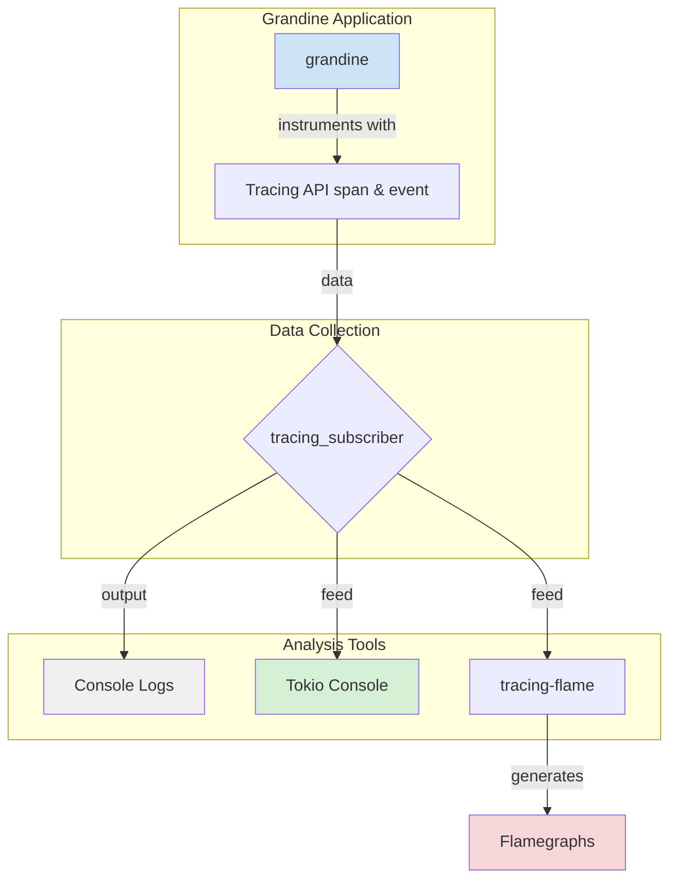
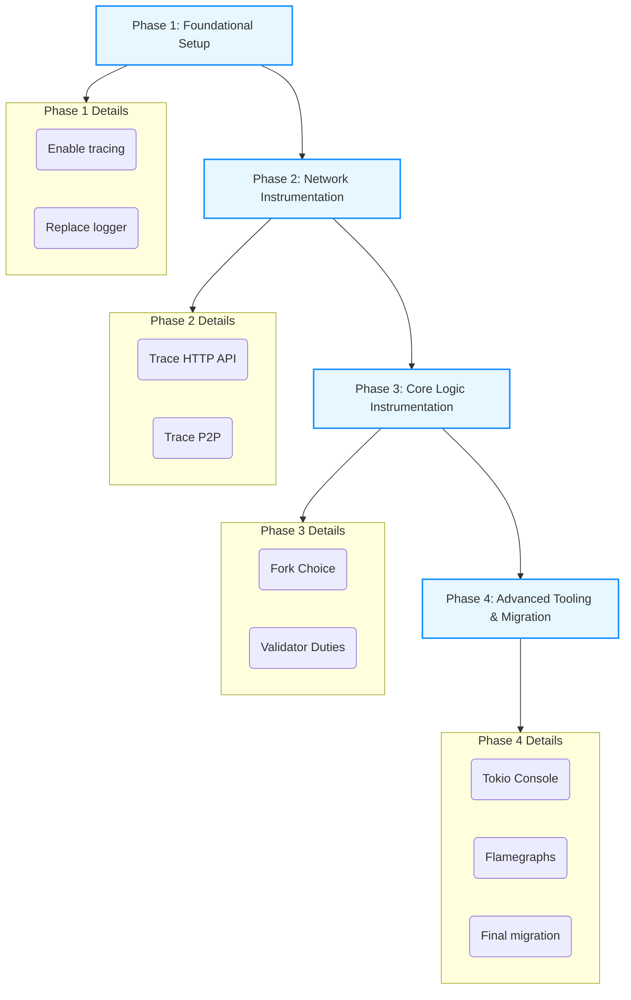

# Grandine: Implementing Tokio Tracing for Debugging and Performance Analysis

## Motivation


**Protocol motivation:**

High-performance Ethereum clients like Grandine need deep observability to ensure correctness, stability, and optimal performance.

**Problem**:  

Currently, Grandine relies on basic logging solutions that do not provide structured, context-aware diagnostics.
This makes it hard to debug complex asynchronous workflows, profile resource usage, and trace performance regressions.

As the client matures and usage scales, lack of robust observability risks introducing subtle bugs and degraded performance that are hard to diagnose.

Therefore, integrating **Tokio Tracing** is essential to improve debugging, performance analysis, and operational visibility across the protocol stack.

**Personal motivation in this project:**

In the development world, effective debugging and observability often take the place of extensive documentation.
Since this is one of my first core development projects, I am glad to focus on this area because it will give me a much clearer picture of what is happening under the hood.

I believe that a deeper understanding of the core protocol’s behavior will open more opportunities for me to contribute in the future.

**Impact:**
- Improved debuggability and issue resolution
- Clear visibility into asynchronous workflows and performance
- Foundation for future metrics and observability tooling

---

### Current Implementation and Limitations

- Grandine uses `binary_utils::initialize_logger()` which sets up a traditional logger (`env_logger`).
- There is limited correlation between events across async tasks.
- No structured spans linking related operations.
- Existing log output is harder to filter by component or operation.


Example command to start the node:
`RUST_LOG=grandine=info cargo run --profile compact --features default-networks --bin grandine -- --network holesky`

Current logging output:


vs

Example tracing-subscriber output:

```
tracing_subscriber::fmt()
    .with_env_filter(EnvFilter::from_default_env())
    .compact()
    .with_file(true)
    .with_line_number(true)
    .with_thread_ids(true)
    .with_target(false) 
    .init();
```


(but the main benefit of tracing is not improved formatting)

The most powerful features of tracing emerge in combination with **Tokio**—*the async executor for Rust*—where classic logging has no practical application.
There, the concept of spans provides a clear view of async workflows and their relationships.

- log::info! produces a simple, standalone log message with no awareness of context or duration.
- In contrast, tracing::info! used inside a span creates an event tied to a broader context.

A **span** represents a timed operation with a start and end, and it can carry structured metadata. All events within a span are linked to it, enabling a clear, hierarchical view of program execution.


---
## Project description and Overview

This proposal is about to integrate Tokio Tracing into Grandine as the primary diagnostics and observability framework.
This will replace the existing log-based system with a modern, structured, and context-aware diagnostics framework using tracing. This will dramatically improve our ability to debug complex concurrent behavior, analyze performance, and ensure the reliability of the beacon node.


The solution will include:
- Instrumenting critical asynchronous components with spans (e.g., networking, block processing, consensus logic).
- Supporting asynchronous performance profiling via tracing subscribers.
- Providing flexible filtering and output layers (e.g.,  logs, flamegraphs, live metrics).
- Ensuring minimal performance overhead in production builds.
This approach empowers developers and operators to trace system behavior end-to-end, analyze performance bottlenecks, and improve reliability.




Tokio Console: A real-time debugging and diagnostics tool for Tokio applications. It gives you a live view of all your tasks, resources, and their behavior. To use it, you need to add the console-subscriber and enable specific tokio trace features.

Flamegraphs with tracing-flame: For performance profiling, you can use tracing-flame and flamegraph to generate flamegraphs. These are visualizations that show exactly where your program is spending its time, which is invaluable for identifying performance bottlenecks.

By integrating Tokio Tracing, you move from simple text-based logging to a powerful, structured diagnostics system that provides deep insights into both the correctness and performance of your application.

---

## Specification

The implementation will deliver the following technical outcomes:

- Tracing Integration
  - `tracing_subscriber` set as the main diagnostics backend.
  - Unified configuration for console logs, JSON output, and optional flamegraph export.
  - Runtime filtering via environment variables.
- Instrumentation
  - HTTP API handlers instrumented to log request lifecycle and parameters.
  - P2P networking spans for peer events and message processing with structured metadata.
  - Fork choice and validator duties instrumented to trace consensus-critical workflows.
- Advanced Tooling
  - Integration with `tokio-console` for live monitoring of tasks.
  - Optional `tracing-flame` support for performance profiling.
- Configurability
  - CLI or config-based toggles for enabling or disabling tracing features.
  - Distinction between production and development modes.
- Documentation
  - Guides and examples for configuring tracing and interpreting outputs.


---

## Roadmap

The project will be implemented in four incremental phases, progressing from foundational setup to advanced tooling and full integration across the Grandine codebase.





### Phase 1: Foundational Setup
Goal: Enable tracing globally and establish a root context for all subsequent diagnostic events.
Requirements: Understand Tokio, Tracing, and Grandine crate organization.

- Initialize tracing_subscriber as the main diagnostics backend.
- Set up default span hierarchy and environment-based log filtering.
- Replace binary_utils basic logger initialization to route all logs through the tracing system.


### Phase 2: Tracing the Network Boundary

Goal: Gain visibility into network boundaries and system entry points.
Requirements: Familiarity with Grandine external interfaces

key components: **HTTP API** & **P2P network**.


Step **2.1**: Instrument the HTTP API
- Key Crate: http_api
- Action: Instrument each function that handles an HTTP endpoint. This will automatically log the start and end of each API call, its duration, and any parameters we choose to include in the span.


Step **2.2**: Instrument the P2P Layer
This is critical for debugging network issues.
- Key Crate: eth2_libp2p
- Action: Add spans and events around network event processing, including peer connections enriched with structured context like peer_id.


### Phase 3: Instrumentation of Core Logic
Goal: Enable observability of consensus-critical components.
Requirements: Understanding the behavior of the **fork choice rule** and **validator duties**.

Step **3.1**: Instrument Fork Choice
- Key Crate: fork_choice_control
- Action: Instrument the key functions that modify or read the fork choice store. This will help debug consensus issues and understand why the node chooses a specific chain head.


Step **3.2**: Instrument Validator Duties
- Key Crate: validator
- Action: Add tracing to the logic that produces blocks and attestations. This will show when a validator is performing its duties and whether it succeeds.


### Phase 4: Advanced Tooling & Full Migration
Goal: Leverage the full power of the tracing ecosystem and complete the migration.
Requirements: Advanced tracing configuration, Tokio runtime options, performance benchmarking, and tooling interpretation.

Step **4.1**: Integrate Tokio Console
This will provide a live, real-time dashboard of all tasks, resources, and their current state.


Step **4.2**: Generate Flamegraphs for Performance **(Optional)**
Action: Introduce tracing-flame to generate flamegraphs from trace data. This is the ultimate tool for visualizing time-based performance and identifying bottlenecks.


Step **4.3**: Final log to tracing Migration
Action: With the core components instrumented, perform a project-wide search and replace of all remaining log:: macros with their tracing:: equivalents. This ensures all diagnostic output is unified under the tracing system.


---
This structured approach ensures a smooth, incremental rollout, providing value at each stage and culminating in a state-of-the-art diagnostics system for the Grandine.

---

## Challenges and Trade-offs

- Performance Overhead: 
    - Careful benchmarking is needed to ensure tracing doesn’t slow down critical paths.
- Complexity of Asynchronous Code: 
    - Properly propagating context across tasks and futures can be tricky.
    - Care must be taken not to introduce performance regressions through excessive span nesting.
- Provide debug mode with detailed spans and info mode with minimal instrumentation.

---

## Goal of the project

Success means Grandine will have:
- Full structured tracing across core components.
- Configurable logging and profiling that can be enabled in development and production.
- Minimal performance impact in release builds.
- Clear guides for developers and operators to debug and monitor the system.
- Improved confidence in performance and correctness as the client evolves.

The project will make Grandine a more robust, maintainable, and production-ready Ethereum client, paving the way for broader adoption and community contributions

---

## Colaborators

### Fellows

[Vukasin Markovic](https://github.com/sntntn)

### Mentors

// soon

## Resources
- [Grandine GitHub Repository](https://github.com/grandinetech/grandine)
- [Tokio Tracing Documentation](https://docs.rs/tracing)
- [Tokio Documentation](https://docs.rs/tokio/latest/tokio/)
- [Tokio Github Repo](https://github.com/tokio-rs/tokio)
- [Tokio Console GitHub Repo](https://github.com/tokio-rs/console)
- [Tracing-flame Documentation](https://docs.rs/tracing-flame)


