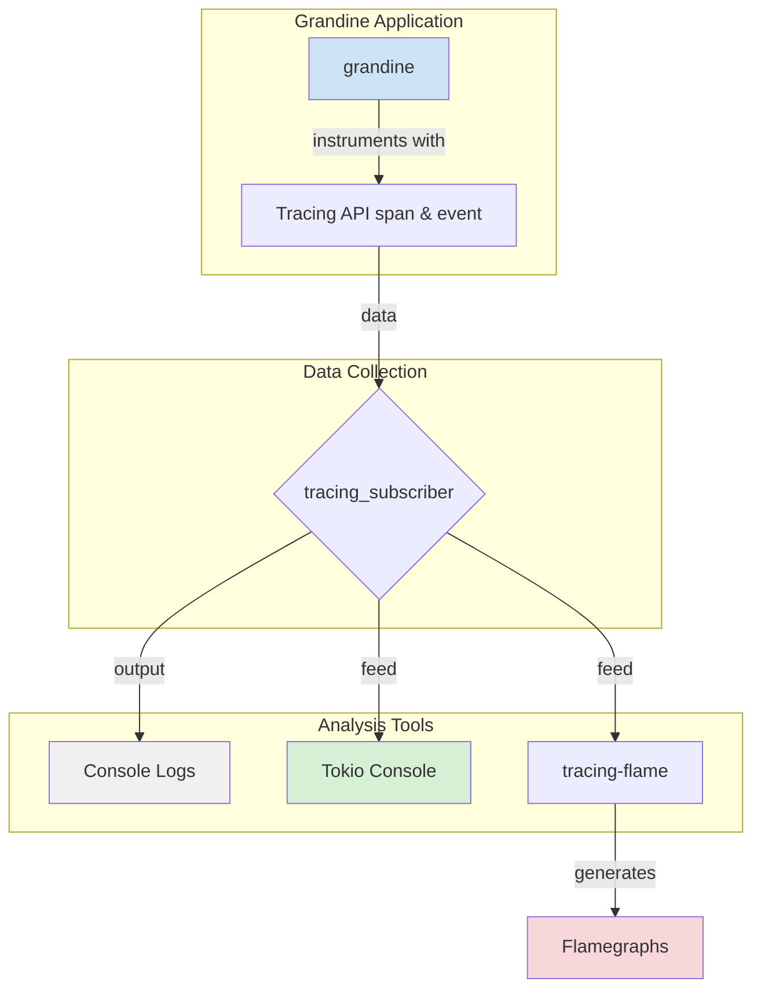
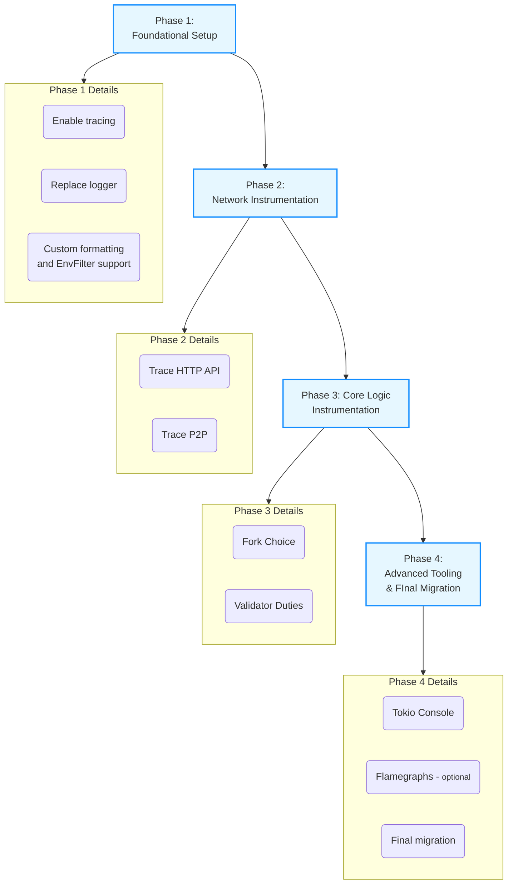

# Grandine: Implementing Tokio Tracing for Debugging and Performance Analysis

## Motivation

High-performance Ethereum clients like Grandine need deep observability to ensure correctness, stability, and optimal performance. Therefore, integrating Tokio Tracing is essential to improve debugging, performance analysis, and operational visibility across the protocol stack.
Since effective debugging and observability often serve as a substitute for extensive documentation, I’m glad to focus on this area — it gives me a clearer understanding of what’s happening under the hood and opens the door to future protocol contributions.

---

### Current Implementation and Limitations

Currently, Grandine relies on basic logging solutions that do not provide structured, context-aware diagnostics. 

- It uses [binary_utils::initialize_logger()](https://github.com/grandinetech/grandine/blob/develop/binary_utils/src/lib.rs), which sets up a traditional env_logger-based system.
- No structured spans linking related operations.
- Existing log output is harder to filter by component or operation.

Here you can see -> [current logging format vs planed tracing format in Grandine](https://hackmd.io/@sntntn/HJ6KSCw8xl)
 (but the main benefit of tracing is not improved formatting)

Grandine, like any other modern consensus client, supports asynchronous functions. While Rust has built-in async/await syntax, it requires an executor to actually run async code. In Grandine's case, that executor is **[Tokio](https://docs.rs/tokio/latest/tokio/)** — *the most widely used async runtime in the Rust ecosystem*.
However, classic loggers like env_logger fall short in async contexts. They lack awareness of task relationships and execution flow.

This is where [**Tokio Tracing**](https://docs.rs/tracing/latest/tracing/) comes in:
The core concept of a [**span**](https://docs.rs/tracing/latest/tracing/span/index.html) allows you to represent timed operations with structured metadata and hierarchical relationships between events. All log events within a span are tied to its context, enabling a clear and navigable view of async workflows.

This approach has already proven valuable in practice. For instance [Lighthouse](https://github.com/sigp/lighthouse), another Rust-based Ethereum consensus client, has already migrated to Tracing to solve similar issues: [PR: #6070](https://github.com/sigp/lighthouse/pull/6070), [PR: #6339](https://github.com/sigp/lighthouse/pull/6339), [PR: #4979](https://github.com/sigp/lighthouse/pull/4979).

---
## Project description and Overview

This proposal is about to integrate Tokio Tracing into Grandine as the primary diagnostics and observability framework.
This will replace the existing log-based system with a modern, structured, and context-aware diagnostics framework using tracing. This will dramatically improve our ability to debug complex concurrent behavior, analyze performance, and ensure the reliability of the beacon node.

The solution will include:
- Instrumenting critical asynchronous components with spans (e.g., networking, block processing, consensus logic).
- Supporting asynchronous performance profiling via tracing subscribers.
- Providing flexible filtering and output layers (e.g.,  logs, live metrics, flamegraphs).
- Ensuring minimal performance overhead in production builds.
This approach empowers developers and operators to trace system behavior end-to-end, analyze performance bottlenecks, and improve reliability.

[Tokio Console](https://github.com/tokio-rs/console): A real-time debugging and diagnostics tool for Tokio applications. It provides a live view of all tasks, resources, and their behavior. Using it requires adding the `console-subscriber` crate and enabling specific Tokio tracing features.

[Flamegraphs](https://www.brendangregg.com/flamegraphs.html) with [tracing-flame](https://docs.rs/tracing-flame): For performance profiling, tracing-flame can be used to generate flamegraphs. These are visualizations that show exactly where execution time is spent, helping to identify and resolve bottlenecks.

---

## Specification

The implementation will deliver the following technical outcomes:

- Tracing Integration
  - `tracing_subscriber` set as the main diagnostics backend.
  - Unified configuration for console logs, JSON output, and optional flamegraph export.
  - Runtime filtering via environment variables.

- Instrumentation
  - HTTP API handlers instrumented to log request lifecycle and parameters.
  - P2P networking spans for peer events and message processing with structured metadata.
  - Fork choice and validator duties instrumented to trace consensus-critical workflows.

- Advanced Tooling
  - Integration with `tokio-console` for live monitoring of tasks.
  - Optional `tracing-flame` support for performance profiling.

- Configurability
  - CLI or config-based toggles for enabling or disabling tracing features.
  - Distinction between production and development modes.

- Documentation
  - Guides and examples for configuring tracing and interpreting outputs.

---

## Roadmap

The project will be implemented in four incremental phases, progressing from foundational setup to advanced tooling and full integration across the Grandine codebase.

Here you can see -> [Detailed Roadmap Phases](https://hackmd.io/@sntntn/B18NisvUll)

---
This structured approach ensures a smooth, incremental rollout, providing value at each stage and culminating in a state-of-the-art diagnostics system for the Grandine.

---

## Challenges and Trade-offs

- Performance Overhead: 
    - Careful benchmarking is needed to ensure tracing doesn’t slow down critical paths.
    
- Complexity of Asynchronous Code: 
    - Properly propagating context across tasks and futures can be tricky.
    - Also, if we create too many nested spans—especially in frequently called parts of the code—we risk slowing down the program and making the traces harder to follow.

- Provide debug mode with detailed spans and info mode with minimal instrumentation.

---

## Goal of the project

Success means Grandine will have:
- Full structured tracing across core components.
- Configurable logging and profiling that can be enabled in development and production.
- Minimal performance impact in release builds.
- Clear guides for developers and operators to debug and monitor the system.
- Improved confidence in performance and correctness as the client evolves.

The project will make Grandine a more robust, maintainable, and production-ready Ethereum client, paving the way for broader adoption and community contributions.

---

## Colaborators

### Fellows

[Vukasin Markovic](https://github.com/sntntn)

### Mentors

// soon

## Resources
- [Grandine GitHub Repository](https://github.com/grandinetech/grandine)
- [Tokio GitHub Repository](https://github.com/tokio-rs/tokio)
- [Tokio Console GitHub Repository](https://github.com/tokio-rs/console)
- [Tokio Tracing Documentation](https://docs.rs/tracing)
- [Tokio Documentation](https://docs.rs/tokio/latest/tokio/)
- [Tracing-flame Documentation](https://docs.rs/tracing-flame)
- [Flame Graphs](https://www.brendangregg.com/flamegraphs.html)
