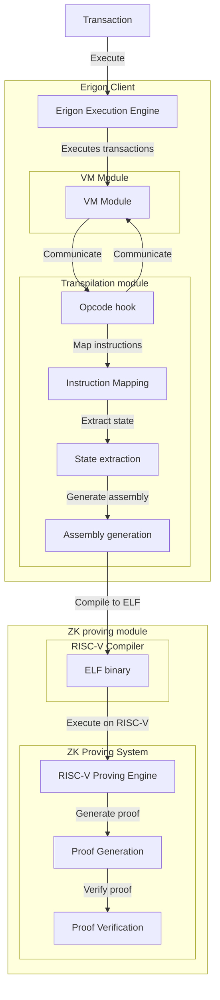

# Erigon: RISC-V Executable Proof Sourcing

1. [Motivation](#motivation)
2. [Project Description](#project-description)
3. [Specification](#specification)
4. [Roadmap](#roadmap)
5. [Possible Challenges](#possible-challenges)
6. [Collaborators](#collaborators)
7. [Resources](#resources)

## Motivation
Current ZK proving systems usually compile the entire EVM implementations into the target instruction (like RISC-V). This increases the number of instructions needed for proof generation by many magnitudes. Vitalik has even [proposed switching the ISA](https://ethereum-magicians.org/t/long-term-l1-execution-layer-proposal-replace-the-evm-with-risc-v/23617) of the EVM to RISC-V to improve the proof generation. This project explores transpilation as a practical stepping stone by generating a RISC-V executable alongside the EVM execution using instruction hooks.

## Project description
The proposed solution is adding an optional transpilation module integrated with Erigon that enables RISC-V ZK proving of transactions without requiring contract recompilation. This approach reduces the proof overhead by only proving executed EVM operations rather than proving an entire EVM implementation in addition to the contract being executed.

## Specification
The high level design visualized:

Breaking this down:
1. **Transaction:** We first start with some transaction that triggers the execution of the EVM within Erigon.
2. **Transpilation:** The VM will communicate with the Erigon transpilation module which will be responsible for acting on the instruction hooks. The final results here will be outputted as a blob of RISC-V assembly.
3. **Compilation:** The RISC-V assembly will then be compiled with some toolchain used by the ZK proving engine.
4. **Proof generation:** The proving engine processes the generated RISC-V binary and generates the associated proof.

Our role is mainly writing the transpilation module. The ZK proving module is mostly "outsourced" in the sense that we only need to find a good toolchain to integrate the transpilation module with. Same is true for the EVM implementation as we will hook into the existing EVM implementation from Erigon.

## Roadmap

### Gaining Foundation (Weeks 1-5, Completed)
This milestone we are now past, it gave us context on the project and familiarity with surrounding technology. We have already done preliminary research to get a sense of how hard things will be to implement:

- **Execution Tracing**: We've developed a [custom Erigon tracer](https://gist.github.com/2xic/1bcccc8cf74419ae0c837fce03285625) capable of capturing detailed execution traces from EVM transactions. We might decide to use more direct hooks onto the VM at a later point.
- **RISC-V Proving Toolchain**: We've built a [basic toolchain](https://gist.github.com/2xic/82ff5065eff396f063c60bb4a281034b) leveraging [OpenVM](https://openvm.dev/) that enables us to generate proofs from raw RISC-V assembly programs. We might decide to change the toolchain at a later point.

The main missing piece is the transpilation module that needs to be written over the next weeks.

### First iteration of the transpilation module (Weeks 5-10)
The first few weeks will involve us writing the first iteration of the transpilation module. This involves handling the mapping of EVM instructions to RISC-V instructions and handling the first version of ELF binary generation.

**Delivery:** We should after this be able to prove simple contracts that we have written ourselves, we will also still be in control of the testing environment. There might be no support for 256-bit arithmetic operations, some limits to control flow and similar simplifications.

### Stabilizing the transpilation module (Weeks 11-17)
For the next milestone we want to stabilize and solve some of the [possible challenges](#possible-challenges) to improve our support of real world contracts.

**Delivery:** We should be able to transpile Uniswap V2 and other [real world applications](https://etherscan.io/topstat#HotContracts) and test it all in (near-)production environment.

### Optimize, benchmarking and evaluation (Weeks 18-21)
At this point we hope to have an implementation that we can run experiments on to get a sense of the feasibility of this approach. We want to benchmark this against other existing approaches. The result of this should be published as part of the conclusion of this project.

**Delivery**: We should provide a quantitative performance comparison between our transpilation approach and existing alternatives including metrics such as transpilation time, binary size, and execution speed.

## Possible challenges
This is a big project and there will obviously be some challenges along the way, we list some of them with possible mitigations that we will try to implement.

### ISA edge case mapping
- **Challenge**: Different ISAs handle edge cases differently (numeric overflows, memory modeling, instruction errors)
- **Impact**: Critical - security issues from incorrect transpilation
- **Mitigation**: Test suite comparing outputs between environments
- **Timeline**: Ongoing throughout the project

### Transpilation correctness
- **Challenge**: Bugs in transpilation module pose serious security risks
- **Impact**: Critical - incorrect translation could compromise system security
- **Mitigation**: Testing, consider [formal verification methods for zkEVM](https://verified-zkevm.org/)
- **Timeline**: Weeks 5-17 as opcodes are implemented

### Word size
- **Challenge**: RISC-V uses 32/64-bit words, EVM uses 256-bit
- **Impact**: High - affects all arithmetic operations
- **Mitigation**: There are algorithms we can use to support 256-bit arithmetic for 32/64-bit RISC-V. There will be some overhead emulating 256-bit over having a native word size of 256-bit. We might be able to mitigate some of that overhead by doing some tricks like using the [RISC-V vector extension](https://github.com/riscvarchive/riscv-v-spec/blob/v1.0/v-spec.adoc) to enable more parallel arithmetic computation.
- **Timeline**: Weeks 11-17

### Special opcodes and Precompiles
- **Challenge**: Some opcodes will be harder to implement directly. For instance `keccak256` and some of the state introspection opcodes like `EXTCODESIZE` / `SELFBALANCE` / `CALLDATALOAD`. Precompiles also don't have a direct transpilation mapping as they are function like syscalls.
- **Impact**: High - many contracts use these opcodes (and precompiles).
- **Mitigation**: For these opcodes, we will be providing the necessary state / side effects directly into the program data location. For precompiles we will probably make them be transpiled as functions which will just map the input to the output of the call to the precompile.
- **Timeline**: Weeks 11-17

*Note: since we are transpiling inline with each transaction, the control flow jumps (`JUMP`/`JUMPI`) are less of an issue as they would effectively be transpiled to a `NOP` opcode (and not a `JUMP` inside the RISC-V program). If time permits, we will look into how we might support control flow jumps later on in the project as supporting them could allow us to do transpilation on the contract level, this would help reduce compilation overhead by reusing the transpiled contract over multiple transactions.*

### Gas accounting
- **Challenge**: Tracking gas cost also won't have a 1:1 mapping with RISC-V instructions.
- **Timeline**: Not in scope.

We don't consider this to be part of the project, but wanted to highlight it as something that might require further research.

## Goal of the project

The success criteria for this project are:
- **MUST**: Transpile and prove simple smart contracts (arithmetic, storage, basic control flow)
- **MUST**: Support production contracts like Uniswap V2 and other [popular contracts](https://etherscan.io/topstat#HotContracts)
- **SHOULD**: Benchmark against other zkEVM approaches and publish analysis of this approach
- **NICE TO HAVE**: Be able to remove some of the simplifications mentioned in [possible challenges](#possible-challenges)

## Collaborators

### Fellow
[Brage](https://github.com/2xic)

_Currently there are no other collaborators on this project. If others are interested and we are aligned on ways everyone can contribute in an efficient way then collaboration is welcome._

### Mentors
[Mark Holt](https://github.com/mh0lt) from [Erigon](https://github.com/erigontech/erigon).

## Resources
- [The original proposal](https://github.com/eth-protocol-fellows/cohort-six/blob/149ab3ec523f466f3871944815469fde55dda1ce/projects/project-ideas.md#erigon-riscv-executable-proof-sourcing) from Mark Holt.
- [The repository](https://github.com/2xic/erigon-risc-v-executable-proof-sourcing) that we are going to be using for the project. Additional resources will be posted there. 
