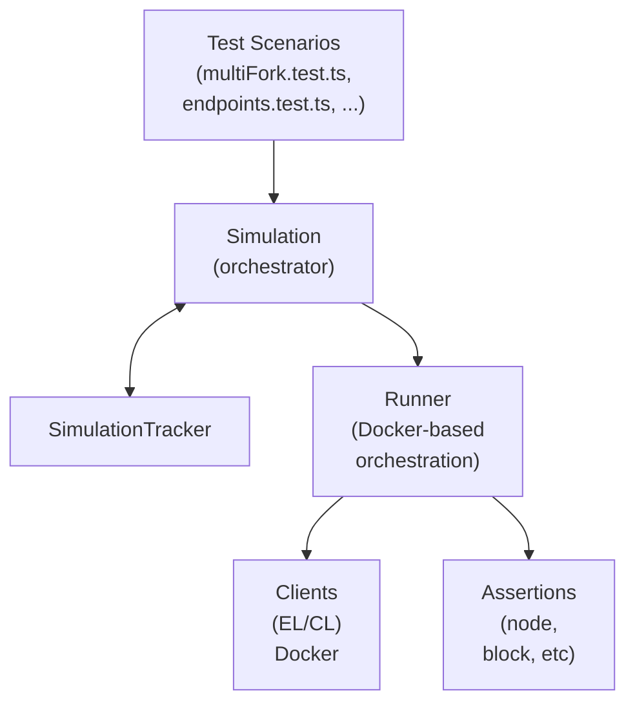
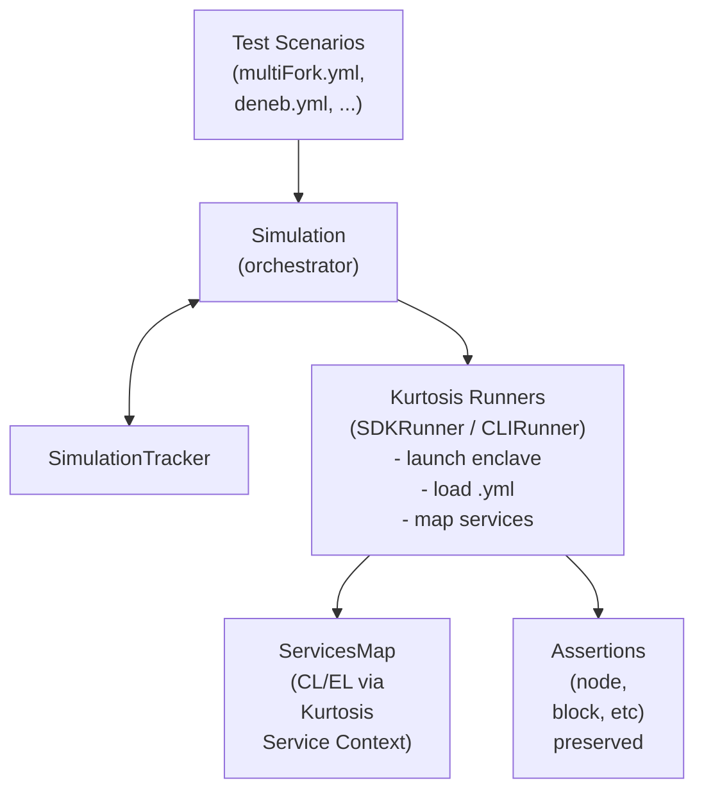
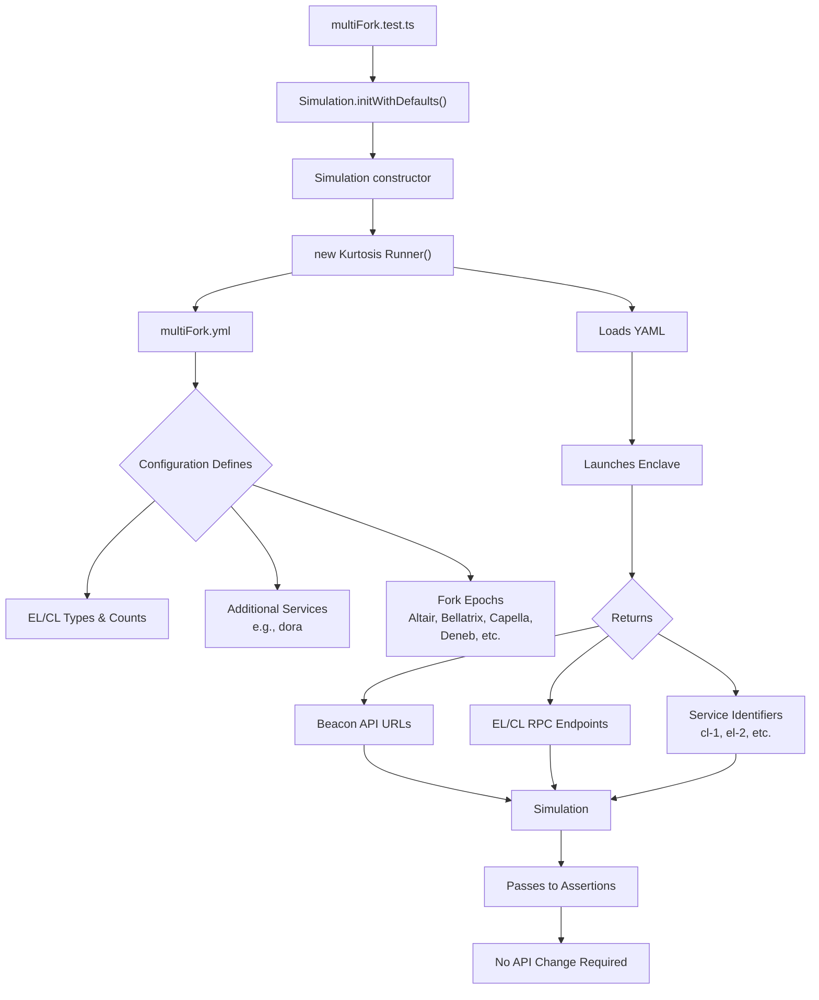

# Lodestar sim tests framework migration to Kurtosis

## **Motivation**

My project aims to support the **migration of Lodestar's sim test framework** to a **Kurtosis-based framework** for test orchestration. 

Lodestar’s current simulation testing framework requires manual configuration and frequent maintenance for each new Ethereum fork, while most Ethereum clients are now standardised on Docker images compatible with Kurtosis.

This migration will primarily impact the **testing** and **orchestrator** layers of the Lodestar protocol stack. 

It will enable easier and more consistent testing of upcoming Ethereum upgrades, reduce time-to-test for new features and align Lodestar with ecosystem-wide testing practices. 

## **Project description**

The proposed solution is to support the migration of Lodestar’s simulation testing infrastructure to Kurtosis. 

This will be a partial migration as the current assertion framework will be maintained. The approach will consist of both a **research phase** and an **implementation phase**. 

The Lodestar test framework relies on a custom Docker-based Runner for endpoint generation. The goal is to migrate to Kurtosis-based endpoints to enable Ethereum testnet deployment and test execution, while maintaining Lodestar's existing assertion suite.

### In detail:

- Replace Docker Runner endpoints with Kurtosis endpoints and the ethereum-package
- **Investigate Kurtosis module development** for generic and specific scenarios
- Understand how to integrate the Kurtosis orchestrator into Lodestar’s internal assertion framework instead of adopting Assertoor
- Adapting Kurtosis to Lodestar assertions: Assertions receive Kurtosis-resolved endpoints instead of hand-built URLs
- Each existing scenario configuration (e.g. **multiFork**) will be translated into a **Kurtosis network config file** (yml) that encodes clients, forks, and timing

- Ensuring **behavior parity** during the migration

## **Specification**

### **Current Architecture Analysis**
The Lodestar simulation framework comprises: Simulation Orchestrator, SimulationTracker, custom Docker Runner, assertion suite, and test scenarios (multifork, endpoints, deneb, mixed clients, backup provider). Migration will proceed incrementally.

### **Research Phase**
- Research **Lodestar codebase**
- Identify main integration points, components **adaptation** vs **replacement**
- **ethereum-package** integration: Study its source code to understand its current configuration and conventions to replicate legacy testing environment properties
- Map out the test sim [framework dependencies](https://github.com/ChainSafe/lodestar/blob/unstable/packages/cli/test/utils/crucible/simulation.ts) and understand the general orchestration workflow
- Evaluate `Simulation` orchestrator and `SimulationTracker` for adaptation feasibility

- Collaborate with Lodestar team to validate assumptions and align on priorities

### **Implementation Strategy**

**Runner Replacement**
- Replace custom Docker Runner (`crucible/runner`) with `Kurtosis Runner` that:
  - Launches **enclaves** using ethereum-package
  - Accepts scenario-specific **.yml* files (e.g., **multiFork.yml**)
  - Returns mapped service endpoints (**CL/VC/EL RPC**) to the Simulation layer

**Assertions Integration** 
- Preserve existing Lodestar assertion suite **without modification**
- Update endpoint resolution to use **Kurtosis-provided URLs** instead of Docker-generated ones

**Simulation orchestration**
- Integrate **Kurtosis Service Map** (service name → host:port mapping) into Simulation layer  
- Configure `Simulation` and `SimulationTracker` to monitor network health using Kurtosis endpoints

**Testing scenario**
- Convert individual test scenarios to Kurtosis-compatible format
- Implement incremental compatibility validation

**Scenarios**

- The new Kurtosis architecture undergoes incremental **compatibility testing**

### Visual specification

**Current Lodestar Simulation Test Framework [Before]:** 

**Migrated Kurtosis-Based Framework [After] :**

**Migrated Kurtosis-Based Framework - multiFork specific:**

## **Roadmap**

The proposed timeline is intentionally adaptive to the team’s needs, with continuous feedback loops to ensure alignment. This roadmap is designed to evolve alongside team feedback and project discoveries. 

### June - mid August - Exploration:

- Ethereum Consensus and testing specs exploration
- Deep-dive into Lodestar codebase
- Deep-dive into the Lodestar sim test framework (e.g. `Runner`, `SimulationEnvironment`, `SimulationTracker`, `assertions`)
- Map dependencies and execution flows
- Map possible integration points
- Identify which components can be replaced, adapted, or preserved
- Collaborate with Lodestar team to validate assumptions and align on priorities
- Incremental Docker phase-out
- Weekly progress checkpoints with the Lodestar team

**Deliverables**: Technical assessment document, integration architecture proposal

**Success criteria**: Clear migration path identified and approved by the team

### Mid Aug - mid October - Tooling integration:

- Proof-of-concept Kurtosis runner implementation
- Design and implement Kurtosis-based endpoint architecture
- Develop adapter layer for existing assertion framework integration
- Create proof-of-concept testnet deployment using Kurtosis endpoints
- Explore feasibility of integrating the existing assertion framework within the Kurtosis testnet
- Collaborate with team members to onboard new tests and validate the test pipeline
- Weekly progress checkpoints with the Lodestar team

**Deliverables**: Proof-of-concept Kurtosis runner implementation, initial adapter layer connecting Kurtosis endpoints to existing assertions

**Success criteria**: 
- Kurtosis runner successfully launches enclaves and returns endpoint mappings
- Team validation of integration approach and architecture decisions
- Clear identification of remaining technical gaps and next steps
- At least one existing test scenario runs end-to-end with Kurtosis endpoints

### Mid October/November - Stabilization:

- Weekly progress checkpoints with the Lodestar team
- Establish testing pipeline for the new architecture
- Final review of the integration: Conduct comparative performance analysis (`Docker` vs. `Kurtosis`)
- Finalize documentation and transition steps
- Summarize the project's outcomes and deliver a presentation at DevCon

## **Potential Challenges**
While I’m still deepening my technical understanding of Ethereum’s Consensus Layer and testing infrastructure, this project offers an opportunity to learn through hands-on exploration, trial and error, and direct collaboration with the Lodestar team.

**Technical Integration:** Integrating `ethpandaops/ethereum-package` and `Kurtosis SDK` while avoiding duplication between the existing simulation framework and new Kurtosis implementation will require careful architectural planning.

**Network Configuration Compatibility**: The ethereum-package may not fully replicate all of Lodestar's current network settings and custom configurations. Specific testing scenarios that rely on particular network topologies, timing configurations, or client-specific parameters may require additional customization or alternative approaches within the Kurtosis and ethereum-package framework.

**Functionality Mapping:** Ensuring feature-complete migration from the current simulation framework to Kurtosis may necessitate architectural adjustments to maintain equivalent functionality.

**Evolving Requirements:** As an exploratory project, scope and priorities may adjust based on ongoing Lodestar team feedback, requiring adaptive project management.

## **Goal of the project**

The project aims to provide a robust initial phase for a Kurtosis-based replacement for Lodestar's core simulation runner, enabling the Lodestar team to evaluate Kurtosis for their testing needs.

**Deliverables:**
- Working Kurtosis-based simulation runner
- Migrated multifork test as proof of concept  
- Documentation covering implementation decisions and migration rationale
- Feasibility assessment highlighting benefits and limitations

**Success Criteria:**
- Lodestar's existing assertion framework integrates seamlessly with Kurtosis
- Test migration workflow shows measurable improvements in maintainability
- Team can independently extend the Kurtosis foundation for future tests

**Impact:**
- A testing infrastructure that serves as a foundation for broader test suite migration
- Enhanced decision-making capability for the Lodestar team regarding further migration steps

**Benefits:**
- **Simplified Architecture**: No need to manage individual client implementations
- Network defined through configuration rather than code
- **Better Isolation**: Services run in isolated enclaves
- Add/remove services through configuration: easier scaling
- Kurtosis handles networking and service discovery

## **Collaborators**

**Fellows**

- [Irene](https://github.com/IreneBa26)

*I'm not currently collaborating with other fellows on this project, but I'm open to and would gladly consider cooperative projects. Please reach out if you're interested.*

## **Mentors**

[Nazar Hussain](https://github.com/nazarhussain)

Additionally, the Lodestar team set up a dedicated thread where everyone can provide answers and clarification. Potential space has been allocated for fellows during their weekly core standups (Tuesdays at 3 PM UTC). 

## **Resources**

**Lodestar**
- [Documentation](https://chainsafe.github.io/lodestar/)
- [GitHub repository](https://github.com/ChainSafe/lodestar)
- [Simulation documentation](https://chainsafe.github.io/lodestar/contribution/testing/simulation-tests/#simulation-assertions)

**Kurtosis**
- [EPF wiki docs](https://epf.wiki/#/wiki/testing/kurtosis)
- [GitHub repository](https://github.com/kurtosis-tech/kurtosis)
- [Official documentation](https://docs.kurtosis.com/)
- [ethpandaops/ethereum-package](https://github.com/ethpandaops/ethereum-package)
- [Kurtosis deep dive guide](https://ethpandaops.io/posts/kurtosis-deep-dive/)
- [ethpandaops/assertoor](https://github.com/ethpandaops/assertoor)
- [Assertoor guide](https://ethpandaops.io/posts/assertoor-introduction/#integration-with-kurtosis)

**Blogs**
- [Ethpandaops note](https://notes.ethereum.org/@ethpandaops)
- [Ethereum Magician forum](https://ethereum-magicians.org/)
- [Ethresearch](https://ethresear.ch/)
