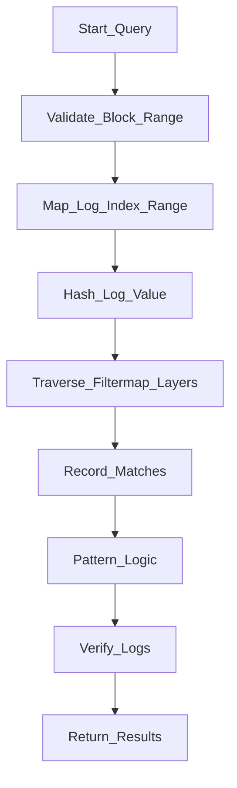

# Pureth Proposal for Erigon

## Introduction

Ethereum clients currently speed up `eth_getLogs` queries using bloom filters, but these filters can generate many false positives—especially as event density increases. To address this, Zsolt introduced **filtermaps**, now implemented in Geth. This proposal details a plan to implement filtermaps in **Erigon**, leveraging EIP-7745 for correctness, completeness and scalability.

## Motivation

False positive ratio in bloom filter rises significantly as the number of events per filter . We want a system that is Correct , Complete and Scalable so EIP 7745 was introduced along with filtermaps 

## Importance

- **Reduces False Positives:** Filtermaps minimize unnecessary log scans .
- **Efficient Log Queries:** Servers avoid sending entire index ranges, optimizing network and compute.
- **Performance:** Benchmarks show notable speed ([see results](https://xcancel.com/sina_mahmoodi/status/1930565142183387627)).

## Project Description

**Goal:**  
Implement filtermaps in Erigon, closely following Zsolt's design in Go-Ethereum (Geth).

### Key Steps

1. **Define Data Structures:** Adapt struct and field definitions for Erigon compatibility.
2. **Design Interfaces:** Create matcher, indexer, and filtermap interfaces for modular implementation.
3. **Implement Core Components:** Develop matcher logic for log value queries, indexer for event indexing, and filtermaps for efficient storage and retrieval.
4. **Add Root Hash to Block Header:** Introduce a consensus-level change replacing `logs_bloom` with a `log_index_root` to enable fully verifiable endpoints.
5. **Integrate Proof System:** Start with Geth’s early proof-of-concept ([log-proofs](https://pureth.guide/log-proofs/)) then try to research as there is not a lot of prior art.
6. **Testing:** Use test vectors, Hive, Kurtosis, and RPC endpoints for comprehensive validation.

### Data Structures

```python
class LogIndex(Container):
    epochs: Vector[LogIndexEpoch, MAX_EPOCH_HISTORY]
    next_index: uint64

class LogIndexEpoch(Container):
    filter_maps: Vector[Vector[FilterRow, MAPS_PER_EPOCH], MAP_HEIGHT]
    log_entries: Vector[LogEntry, MAPS_PER_EPOCH * VALUES_PER_MAP]

type FilterRow = ProgressiveByteList[MAX_BASE_ROW_LENGTH * log2(MAP_WIDTH) // 8 * MAPS_PER_EPOCH, LAYER_COMMON_RATIO]

class LogEntry(Container):
    log: Log
    meta: LogMeta

class LogMeta(Container):
    block_number: uint64
    transaction_hash: Root
    transaction_index: uint64
    log_in_tx_index: uint64

class Log(Container):
    address: ExecutionAddress
    topics: List[Bytes32, MAX_TOPICS_PER_LOG]
    data: ProgressiveByteList[MAX_LOG_DATA_SIZE, 4]

class BlockDelimiterEntry(Container):
    dummy_log: Log
    meta: BlockDelimiterMeta

class BlockDelimiterMeta(Container):
    block_number: uint64
    block_hash: Root
    timestamp: uint64
    dummy_value: uint64  # 2**64-1
```

### Consensus Changes

replace the `logs_bloom` field of the header schema with `log_index_root` which is the root hash of the LogIndex structure after adding the logs emitted in the given block.

## Filtermaps Components and Flow

### Overview

- **Matcher:** Matches requested log values using multi-layer hash mapping.
- **Indexer:** Indexes events sequentially for rapid lookups.
- **Filtermaps:** Multi-layered structure enables efficient queries and proof generation.

### Flowchart



### Multi-layer Mapping Logic

```go
for layer := 0; layer < maxLayers; layer++ {
    idx := hashFNV(value, layer) // position in layer’s row
    entry := row[layer][idx]     // 24-bit number or marker
    if entry == 0 {
        break // no match
    }
    if entry < threshold {
        recordPotentialMatches(layer, idx, entry)
        break
    }
    // entry >= threshold, go deep
}
```

### Pattern Matching and Verification

- **matchAnyProver:** Logical OR across topic values.
- **matchSequenceProver:** Logical AND for specific topics.
- **False Positive Filtering:** Final step checks actual log contents via Merkle proofs.

### Proof System

- Compact binary proofs encode query, roots, layer data, and Merkle log proofs.
- Partial rows handled by descending to finer layers.
- Test vectors in `.proof` and `.json` formats validate correctness.

## Roadmap

**Milestone 0**
- **Weeks 6–7:** Familiarize with Erigon and start designing filtermaps specification.

**Milestone 1**
- **Weeks 8–10:** Implement mathematical utilities, map renderer, and filtermaps data structure. Write initial unit tests.

**Milestone 2**
- **Weeks 11–16:** Build indexer, matcher, matcher backe nd. Expand test coverage.

**Milestone 3**
- **Weeks 17–20:** Implement proof generation and verification mechanisms.

**Milestone 4**
- **Weeks 20–21:** Test thoroughly using Hive, Kurtosis, and RPC endpoints. Develop custom and integration tests.

**Milestone 5**
- **Week 21+:** -  Pursue further performance optimizations or will consider additional EIPs if log-filter changes are achieved.

## Challenges

- Adapting complex EIP logic
- Some library issues or differences between geth and erigon.
- For proofs, there is not a lot of prior work done 

## Goals

- **Complete working filtermaps integration** in Erigon.
- **Verifiable, efficient log queries**.
- Comprehensive testing for the code implemented.

## Mentor 

[Etan Kissling](https://github.com/etan-status)

## Resources
https://pureth.guide
https://purified-web3.box 
https://github.com/zsfelfoldi/eip-7745
https://github.com/ethereum/go-ethereum/compare/master...zsfelfoldi:go-ethereum:proof-poc
